# Familiars

[](https://github.com/jalcantarab/agent-familiars/actions/workflows/validate.yml)
[](LICENSE)
[](catalog/pets.json)

[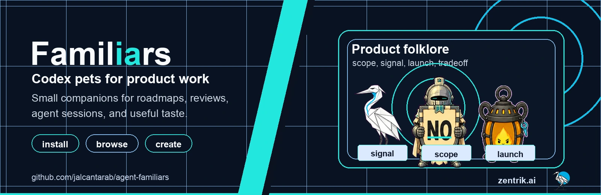](https://zentrik.ai)

Installable Codex pets for agent work, long-running sessions, and small moments
of useful delight. Familiars includes 67 pet bundles, curated packs, a CLI, a
local MCP server, and a renderer for GIFs, MP4s, and posters.

Created with care by [Zentrik](https://zentrik.ai), where we think a lot about
helping product teams turn intent into better software.

| Install | Choose | Render | Connect |
| --- | --- | --- | --- |
| Drop pets into Codex with one command. | Pick from quiet tools, product folklore, and developer companions. | Generate README cards, GIFs, MP4s, and pack comparisons. | Let agents inspect, install, and render through MCP. |

## See It Move

[](assets/showcase/familiars-reel.mp4)

The reel is generated from committed pet spritesheets. Each transition is meant
to belong to the character: paper folds, shield stamps, ash reforms, traces
connect, and tiny review marks settle.

| Product Review Council | Team Rally | No Knight Spotlight |
| --- | --- | --- |
| [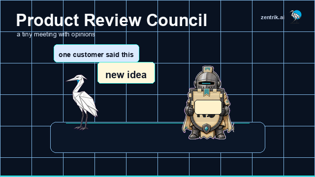](assets/showcase/product-review-council.mp4) | [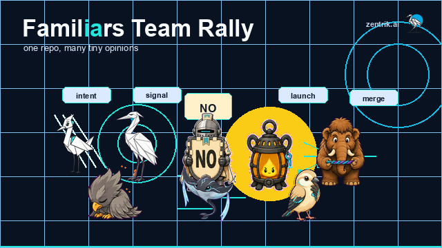](assets/showcase/team-rally.mp4) | [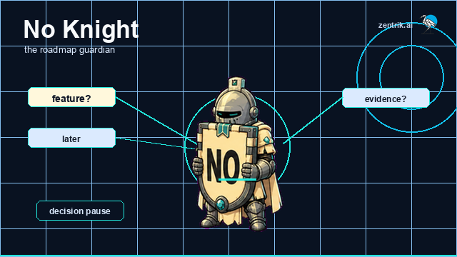](assets/showcase/no-knight-spotlight.mp4) |

The reel links to the MP4 version. More GIFs are available for the
[team rally](assets/showcase/team-rally.gif),
[calm team rally](assets/showcase/team-rally-calm.gif),
[product council](assets/showcase/product-review-council.gif), and
[No Knight spotlight](assets/showcase/no-knight-spotlight.gif). MP4 versions
live beside them in [assets/showcase](assets/showcase).

## Try One

Install one familiar without cloning the repository:

```bash
curl -fsSL \
  https://raw.githubusercontent.com/jalcantarab/agent-familiars/main/scripts/install_pet.py \
  | python3 - zentri
```

Then open Codex:

```text
Settings -> Personalization -> Pets -> Refresh custom pets -> select the pet
```

Use the pet overlay from settings, the command palette, or the `/pet` composer
command.

<details>
<summary>More install, CLI, render, and MCP commands</summary>

Install a pack without cloning:

```bash
curl -fsSL \
  https://raw.githubusercontent.com/jalcantarab/agent-familiars/main/scripts/install_pet.py \
  | python3 - --pack starter
```

Use the CLI from a clone:

```bash
git clone https://github.com/jalcantarab/agent-familiars.git
cd agent-familiars
python -m pip install -e .
familiars list packs
familiars install zentri
```

Install useful packs:

```bash
familiars install --pack starter
familiars install --pack state-instruments
familiars install --pack product-tropes
familiars install --pack first-50
```

Render your own lightweight GIFs, posters, or pack comparisons:

```bash
familiars render --pet no-knight --preset spotlight --outputs poster
familiars render --pack state-instruments --preset comparison
```

Use the local MCP server with agents:

```bash
python -m pip install -e ".[mcp]"
familiars-mcp
```

Or ask Codex to do the local install:

```text
Go to https://github.com/jalcantarab/agent-familiars and install the zentri pet
into my local Codex pets folder. Then tell me to refresh custom pets in Codex.
```

</details>

For deeper setup, recipe, and agent integration details, see the
[Install guide](docs/INSTALL.md), [Create A Sequence](docs/CREATE_A_SEQUENCE.md),
and [MCP server](docs/MCP.md).

## Where It Works

Familiars has two layers: Codex-native pet bundles, and portable assets/tools
for agents, docs, and sharing.

| Surface | Live pet? | How to use Familiars |
| --- | --- | --- |
| Codex Desktop | Yes | Install a pet or pack, refresh custom pets, then select it in Pets settings. |
| Claude Code | Not natively | Use the CLI or local MCP server to inspect, choose, render, or install pets into Codex. |
| Claude Desktop | Not natively | Add `familiars-mcp` as a local MCP server to browse, render, and install assets. |
| Claude web, mobile, or API | Not directly | Use exported GIFs, MP4s, posters, or a future hosted remote MCP surface. |
| Other MCP clients | Tools only | Connect to the local MCP server for catalog, render, recipe, and install tools. |
| GitHub, docs, websites, social posts | No | Use the generated README cards, showcase GIFs, MP4s, and posters. |

All pets share the same installable Codex bundle shape. Outside Codex, they are
usable when a tool can read that atlas format or when you render portable media
from the CLI/MCP server. For deeper ecosystem notes, see
[Ecosystem Tools](docs/ECOSYSTEM_TOOLS.md).

## Pick A Familiar

Start with the kind of companion you want on screen. These compact GIF cards use
the same frame, pace, and background so the chooser moves without turning into a
wall of motion.

| Product judgment | Developer workflow | Quiet instruments |
| --- | --- | --- |
| [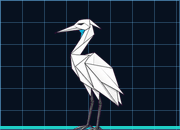](pets/signal-heron)<br>[Signal Heron](pets/signal-heron)<br><sub>quiet customer signal</sub> | [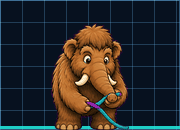](pets/merge-mammoth)<br>[Merge Mammoth](pets/merge-mammoth)<br><sub>patient conflict help</sub> | [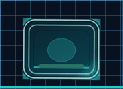](pets/signal-surface)<br>[Signal Surface](pets/signal-surface)<br><sub>status at a glance</sub> |
| [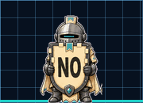](pets/no-knight)<br>[No Knight](pets/no-knight)<br><sub>the roadmap guardian</sub> | [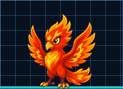](pets/ci-phoenix)<br>[CI Phoenix](pets/ci-phoenix)<br><sub>rebuilds from failure</sub> | [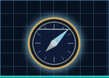](pets/intent-compass)<br>[Intent Compass](pets/intent-compass)<br><sub>direction and indecision</sub> |

For a fuller chooser, see [Choosing A Familiar](docs/CHOOSING_A_FAMILIAR.md).

Each pet folder includes the installable `spritesheet.webp`, a `pet.json`, a
nine-state animation catalog, and a contact sheet for checking the complete
atlas.

## Browse Packs

- `starter`: the recommended default set, including Signal Surface for a quiet
  status-first option.
- `product-tropes`: product folklore pets for roadmaps, tradeoffs, launches,
  signal, alignment, and scope control.
- `state-instruments`: calm, useful object-familiars for readable Codex state
  changes.
- `first-50`: the complete first curation set for developer and agent work.

## Product Folklore

The product-trope pack is for people who spend real time around roadmap
arguments, customer signal, launch readiness, and the useful kind of `no`.

| Product Review Council | No Knight Spotlight |
| --- | --- |
| [](assets/showcase/product-review-council.gif) | [](assets/showcase/no-knight-spotlight.gif) |
| Signal, scope, tradeoffs, and launch all show up to the same tiny meeting. | The roadmap guardian keeps the joke visible without covering the shield. |

Open the GIFs directly: [Product Review Council](assets/showcase/product-review-council.gif)
and [No Knight Spotlight](assets/showcase/no-knight-spotlight.gif).

| Pet | Product Moment | License / Source |
| --- | --- | --- |
| [No Knight](pets/no-knight) | Protects focus with a shield-billboard boundary. | Original, MIT |
| [Feature Hydra](pets/feature-hydra) | Makes feature creep visible as regrowing heads. | Original, MIT |
| [MVP Bonsai](pets/mvp-bonsai) | Shows MVP discipline through pruning. | Original, MIT |
| [Backlog Archaeologist](pets/backlog-archaeologist) | Excavates old backlog fossils with skepticism. | Original, MIT |
| [Signal Heron](pets/signal-heron) | Finds customer signal through stillness. | Original, MIT |
| [Priority Sphinx](pets/priority-sphinx) | Blocks progress until the tradeoff is answered. | Original, MIT |
| [Alignment Magnet](pets/alignment-magnet) | Turns competing directions into visible convergence. | Original, MIT |
| [Stakeholder Weather Vane](pets/stakeholder-weather-vane) | Shows shifting opinions as pressure on a vane. | Original, MIT |
| [Tradeoff Scale](pets/tradeoff-scale) | Balances product choices as actual weight. | Original, MIT |
| [Launch Lantern](pets/launch-lantern) | Tunes launch readiness as a protected flame. | Original, MIT |
| [RICE Centurion](pets/rice-centurion) | Scores prioritization as a clumsy wax-tablet ritual. | Original, MIT |

## State Instruments

| Signal Surface | Intent Compass | Tide Stone |
| --- | --- | --- |
| [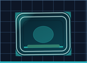](pets/signal-surface)<br>[Signal Surface](pets/signal-surface)<br><sub>status at a glance</sub> | [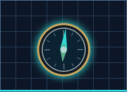](pets/intent-compass)<br>[Intent Compass](pets/intent-compass)<br><sub>direction and indecision</sub> | [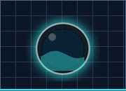](pets/tide-stone)<br>[Tide Stone](pets/tide-stone)<br><sub>calm liquid state</sub> |

The full machine-readable catalog lives in [catalog/pets.json](catalog/pets.json).
Pack definitions live in [catalog/packs.json](catalog/packs.json).
The design notes for the first 50 live in
[catalog/first-50-motion.json](catalog/first-50-motion.json).

<details>
<summary>First-50 catalog</summary>

| Pet | Vibe | License / Source |
| --- | --- | --- |
| [Zentri](pets/zentri) | Zentrik-inspired folded-paper crane for PM-agent workflows. | Original, MIT |
| [Merge Mammoth](pets/merge-mammoth) | Patient merge-conflict helper with trunk-led conflict untangling. | Original, MIT |
| [CI Phoenix](pets/ci-phoenix) | CI recovery companion that rebuilds from ash into passing checks. | Original, MIT |
| [Patch Panda](pets/patch-panda) | Careful patch-application helper with tactile repair motion. | Original, MIT |
| [Product Crane](pets/product-crane) | Folded-paper planning companion for prioritization and review. | Original, MIT |
| [Test Tortoise](pets/test-tortoise) | Slow reliable test-runner with shell-matrix progress. | Original, MIT |
| [Diff Dragon](pets/diff-dragon) | Restrained diff reviewer that marks changed lines with its tail. | Original, MIT |
| [Queue Crab](pets/queue-crab) | Sideways job-queue helper with pending-slot claws. | Original, MIT |
| [Context Cat](pets/context-cat) | Long-context companion with tangled-loaf overload. | Original, MIT |
| [Prompt Parrot](pets/prompt-parrot) | Prompt-refinement companion with beak-and-feather cadence. | Original, MIT |
| [Build Bot](pets/build-bot) | Tiny build robot with chest-panel progress loops. | Original, MIT |
| [Cache Squirrel](pets/cache-squirrel) | Dependency-cache companion with tail-pocket stash loops. | Original, MIT |
| [Latency Lemur](pets/latency-lemur) | Performance companion whose tail behaves like a timing graph. | Original, MIT |
| [Trace Manta](pets/trace-manta) | Observability companion with fin-ripple trace flow. | Original, MIT |
| [Log Lynx](pets/log-lynx) | Log-scanning companion that finds the exact line. | Original, MIT |
| [Database Mole](pets/database-mole) | Schema companion that packs row-like blocks into neat layers. | Original, MIT |
| [Fixture Fox](pets/fixture-fox) | Test-fixture companion with tail-carried sample blocks. | Original, MIT |
| [Type Terrier](pets/type-terrier) | Compiler-error companion that digs at type mismatches. | Original, MIT |
| [Python Pangolin](pets/python-pangolin) | Refactor companion with curl-unroll scale mechanics. | Original, MIT |
| [Borrow Badger](pets/borrow-badger) | Ownership companion that guards a token-pebble through borrow decisions. | Original, MIT |
| [Goroutine Gecko](pets/goroutine-gecko) | Concurrency companion with sticky-toe scheduling and staggered lane checks. | Original, MIT |
| [React Gecko](pets/react-gecko) | Frontend state companion with sticky-toe component transitions. | Original, MIT |
| [Design Finch](pets/design-finch) | UI QA companion that measures spacing with tiny precise hops. | Original, MIT |
| [Pixel Penguin](pets/pixel-penguin) | Blocky server-room companion with square system-check cadence. | Original, MIT |
| [Container Hermit](pets/container-hermit) | Local-services companion whose shell compartments start and settle. | Original, MIT |
| [Cluster Puffer](pets/cluster-puffer) | Scheduler companion with balanced node-spot inflation. | Original, MIT |
| [Release Rocket](pets/release-rocket) | Controlled deployment companion with fins and attached flame-readiness cues. | Original, MIT |
| [Incident Axolotl](pets/incident-axolotl) | Calm incident responder with frill-led escalation and recovery posture. | Original, MIT |
| [Search Salmon](pets/search-salmon) | Code-search companion that swims upstream through results. | Original, MIT |
| [Docs Jelly](pets/docs-jelly) | Documentation companion that organizes tendrils into readable structure. | Original, MIT |
| [Schema Snail](pets/schema-snail) | Careful schema companion with shell-band version alignment. | Original, MIT |
| [Refactor Rabbit](pets/refactor-rabbit) | Tidy refactor companion that cleans attached code-block stacks. | Original, MIT |
| [Roadmap Raven](pets/roadmap-raven) | Planning companion whose tail feathers act like timeline lanes. | Original, MIT |
| [Meeting Moth](pets/meeting-moth) | Transcript companion that folds chatter into summary pages. | Original, MIT |
| [Approval Alpaca](pets/approval-alpaca) | Patient human-approval companion with a dignified long-neck handoff. | Original, MIT |
| [Sandbox Seal](pets/sandbox-seal) | Experiment companion that pats safe sandbox boundaries into shape. | Original, MIT |
| [Notebook Newt](pets/notebook-newt) | Data notebook companion whose tail marks cell execution order. | Original, MIT |
| [Security Sentinel](pets/security-sentinel) | Secure-review companion with quiet checkpoint and trust-boundary scanning. | Original, MIT |
| [Migration Mantis](pets/migration-mantis) | Migration companion that moves one block from old path to new path. | Original, MIT |
| [Demo Dolphin](pets/demo-dolphin) | Product-demo companion with polished story-beat presentation. | Original, MIT |
| [Terminal Ghost](pets/terminal-ghost) | Friendly CLI companion. | MIT, imported from `gennadi-kuzmin/awesome-codex-pets` |
| [Review Owl](pets/review-owl) | Calm reviewer for PR and diff work. | MIT, imported from `gennadi-kuzmin/awesome-codex-pets` |
| [Bug Hunter](pets/bug-hunter) | Debugging detective. | MIT, imported from `gennadi-kuzmin/awesome-codex-pets` |
| [Bug Searcher](pets/bug-searcher) | Bug-finding search companion. | MIT, imported from `gennadi-kuzmin/awesome-codex-pets` |
| [Rubber Duck 2.0](pets/rubber-duck-2-0) | Classic debugging ritual for AI coding. | MIT, imported from `gennadi-kuzmin/awesome-codex-pets` |
| [Token Vampire](pets/token-vampire) | Token-limit joke pet for heavy agent users. | MIT, imported from `gennadi-kuzmin/awesome-codex-pets` |
| [Ladybug Dev](pets/ladybug-dev) | Tiny developer bug companion. | MIT, imported from `gennadi-kuzmin/awesome-codex-pets` |
| [Toffee](pets/toffee) | Cream toy poodle. | CC BY 4.0, imported from `mertcreates/codex-paws` |
| [Rozi](pets/rozi) | British Shorthair x Ragdoll cat. | CC BY 4.0, imported from `mertcreates/codex-paws` |
| [Tabby](pets/tabby) | Compact brown tabby cat. | MIT, imported from `xixu-me/codex-pets` |

</details>

## Create Your Own

Use [Create A Pet](docs/CREATE_A_PET.md) to shape a pet brief, define
state-specific motion, package the atlas, and validate it before sharing.
Zentri is the reference example: a small folded-paper crane inspired by
[Zentrik](https://zentrik.ai), with motion that comes from creases, balance,
and a single cyan intent accent.

For deeper craft, use the [Pet Creation Playbook](docs/PET_CREATION_PLAYBOOK.md)
and [Animation Bible](docs/ANIMATION_BIBLE.md). To make a reusable GIF, poster,
or pack comparison from your pets, see
[Create A Sequence](docs/CREATE_A_SEQUENCE.md). For handcrafted social reels,
see [Create A Reel](docs/CREATE_A_REEL.md). For local routines that rotate
variants or review pets over time, see
[Automated Pet Routines](docs/AUTOMATED_PET_ROUTINES.md).

## What Makes A Good Familiar

A familiar should be:

- readable at small desktop size
- emotionally legible across work states: idle, working, waiting, review, failed
- brand-safe, original, or clearly licensed for redistribution
- useful as culture, not just decoration
- specific in motion, not just a generic jump with a different outline

## Repository Map

- [Install guide](docs/INSTALL.md)
- [Choosing a familiar](docs/CHOOSING_A_FAMILIAR.md)
- [Create a pet](docs/CREATE_A_PET.md)
- [Create a sequence](docs/CREATE_A_SEQUENCE.md)
- [Create a reel](docs/CREATE_A_REEL.md)
- [CLI](docs/CLI.md)
- [MCP server](docs/MCP.md)
- [CLI and MCP roadmap](docs/CLI_MCP_ROADMAP.md)
- [Automated pet routines](docs/AUTOMATED_PET_ROUTINES.md)
- [State instruments](docs/STATE_INSTRUMENTS.md)
- [First-50 plan](docs/FIRST_50.md)
- [Product trope pets](docs/PRODUCT_TROPE_PETS.md)
- [Ecosystem tools](docs/ECOSYSTEM_TOOLS.md)
- [Licensing policy](docs/LICENSING.md)
- [Maintainer workflow](docs/MAINTAINER_WORKFLOW.md)
- [Release guide](docs/RELEASE.md)

## Validate

```bash
python scripts/validate_pets.py
python scripts/validate_design_specs.py
python scripts/validate_docs.py
python scripts/check_release_readiness.py
python scripts/render_brand_assets.py --check
python scripts/render_readme_cards.py --check
python scripts/render_previews.py --all --check
python scripts/render_sequence.py --check
python scripts/render_reel.py --check
PYTHONPYCACHEPREFIX=/tmp/agent-familiars-pycache python -m py_compile setup.py scripts/check_release_readiness.py scripts/install_pet.py scripts/render_brand_assets.py scripts/render_readme_cards.py scripts/render_previews.py scripts/render_sequence.py scripts/render_reel.py scripts/smoke_mcp_client.py scripts/validate_pets.py scripts/validate_design_specs.py scripts/validate_docs.py scripts/generate_signal_surface.py scripts/generate_state_instruments.py scripts/rotate_installed_pet_variant.py familiars/__init__.py familiars/cli.py familiars/limits.py familiars/mcp_server.py familiars/pet_assets.py familiars/sequence_presets.py familiars/sequence_schema.py familiars/sequence_renderer.py
python -m pip install -e .
familiars validate
python -m pip install -e ".[mcp]"
python -c "from familiars.mcp_server import build_server; build_server(); print('mcp ok')"
python scripts/smoke_mcp_client.py
python -m pip wheel . --no-deps -w /tmp/agent-familiars-wheelhouse
```

To regenerate preview media from committed spritesheets:

```bash
python scripts/render_previews.py --all --force
```

To regenerate the README banner from committed spritesheets:

```bash
python scripts/render_brand_assets.py
```

To regenerate showcase media:

```bash
python scripts/render_reel.py
```

To create local sequence exports without committing media:

```bash
python scripts/render_sequence.py --pet no-knight --preset spotlight
python scripts/render_sequence.py --pack state-instruments --preset comparison
```

## Licensing

The default license is MIT for repository code, documentation, catalog metadata,
original pet bundles, and previews generated from those original bundles unless
a file says otherwise. Imported pets keep their upstream licenses; two imported
companions from Codex Paws are CC BY 4.0 and require attribution when reused.

Before redistributing pets, check [docs/LICENSING.md](docs/LICENSING.md),
[NOTICE.md](NOTICE.md), and [catalog/pets.json](catalog/pets.json). Zentrik
names and logos appear for project identity and examples, but the MIT license
does not grant standalone brand or trademark rights.

Beyond required license notices, attribution is appreciated: if Familiars helps
your project, a link back to this repository is welcome.
