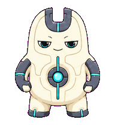
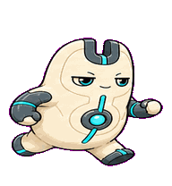
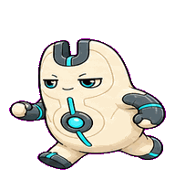
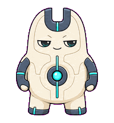
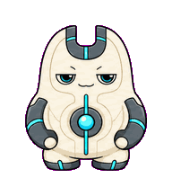
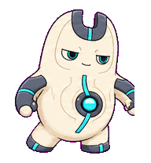
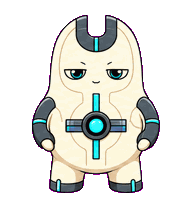
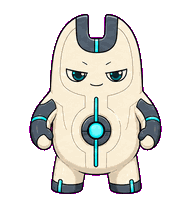
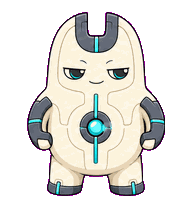

# Alignment Magnet

A product-team alignment companion that turns competing directions into visible
polarity and convergence.



## Animation Catalog

| Idle | Running Right | Running Left |
| --- | --- | --- |
|  |  |  |

| Waving | Jumping | Failed |
| --- | --- | --- |
|  |  |  |

| Waiting | Running | Review |
| --- | --- | --- |
|  |  |  |

The full Codex install asset is [`spritesheet.webp`](spritesheet.webp). GIF previews are rendered from the committed spritesheet for GitHub review.

## Install

```bash
mkdir -p ~/.codex/pets
cp -R pets/alignment-magnet ~/.codex/pets/
```

Then refresh custom pets in Codex and select `Alignment Magnet`.

## Motion Notes

- `idle`: holds a smug almost-still stance while the polarity plates breathe out of phase.
- `running-right` / `running-left`: slides in the direction of magnetic pull.
- `waving`: flips one attached plate outward as a tiny diplomatic greeting.
- `jumping`: makes a low repulsion hop and clicks back into alignment.
- `failed`: bows off-axis under over-repelling plates without loose effects.
- `waiting`: presents conflicting plate angles and waits for a decision.
- `running`: rotates noisy plate angles into one coherent axis.
- `review`: locks the plates into a clean settled alignment.

## Source

- Origin: original pet generated for Familiars.
- Author: Jorge Alcantara / Zentrik.
- License: MIT for this pet bundle in this repository.

## Preview

Full contact sheet: [preview/contact-sheet.png](preview/contact-sheet.png)
