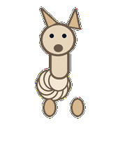
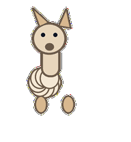
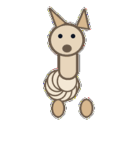
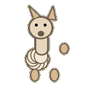
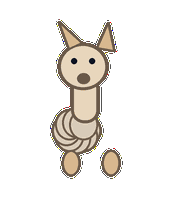
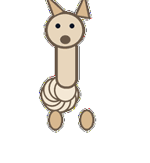
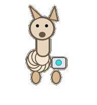
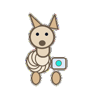

# Approval Alpaca

A patient approval alpaca whose long neck and woolly posture make human handoff feel calm.



## Animation Catalog

| Idle | Running Right | Running Left |

| --- | --- | --- |

|  |  |  |


| Waving | Jumping | Failed |

| --- | --- | --- |

|  |  |  |


| Waiting | Running | Review |

| --- | --- | --- |

|  |  |  |


The full Codex install asset is [`spritesheet.webp`](spritesheet.webp). GIF previews are rendered from the committed spritesheet for GitHub review.

## Install

```bash
mkdir -p ~/.codex/pets
cp -R pets/approval-alpaca ~/.codex/pets/
```

Then refresh custom pets in Codex and select `Approval Alpaca`.

## Motion Notes

- `idle`: stands dignified with a small wool bounce.

- `running-right`: steps right with the neck leading and wool moving gently.

- `running-left`: steps left with the neck leading and wool moving gently.

- `waving`: gives a small ear-and-hoof acknowledgement.

- `jumping`: makes a tiny woolly hop while the neck stays composed.

- `failed`: wool flattens and ears angle outward after a rejected handoff.

- `waiting`: stretches its neck toward the user with patient ears-forward posture.

- `running`: checks between two attached wool puffs as approval options.

- `review`: bends its neck down into a careful sign-off inspection.

## Source

- Origin: original pet generated for Familiars.

- Author: Jorge Alcantara / Zentrik.

- License: MIT for this pet bundle in this repository.

## Preview

Full contact sheet: [preview/contact-sheet.png](preview/contact-sheet.png)
