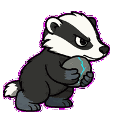
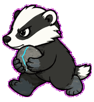
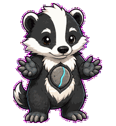

# Borrow Badger

An ownership badger that guards one attached token-pebble through borrow decisions.


## Animation Catalog

| Idle | Running Right | Running Left |
| --- | --- | --- |
|  |  |  |

| Waving | Jumping | Failed |
| --- | --- | --- |
|  |  |  |

| Waiting | Running | Review |
| --- | --- | --- |
|  |  |  |

The full Codex install asset is [`spritesheet.webp`](spritesheet.webp). GIF previews are rendered from the committed spritesheet for GitHub review.

## Install

```bash
mkdir -p ~/.codex/pets
cp -R pets/borrow-badger ~/.codex/pets/
```

Then refresh custom pets in Codex and select `Borrow Badger`.

## Motion Notes

- `idle`: breathes low and stubbornly, keeping the token-pebble close.
- `running-right` / `running-left`: trots with shoulders leading and the guarded pebble held tight.
- `waving`: greets by lifting a paw without releasing the token.
- `jumping`: performs a grounded dig-hop with compressed front paws.
- `failed`: crosses paws over the token in a blocked-borrow posture.
- `waiting`: holds two paw positions apart, asking which reference gets access.
- `running`: passes the attached token-pebble between sides, then tucks it back.
- `review`: inspects a tight lifetime arc at chest level while one paw guards the token.

## Source

- Origin: original pet generated for Familiars.
- Author: Jorge Alcantara / Zentrik.
- License: MIT for this pet bundle in this repository.

## Preview

Full contact sheet: [preview/contact-sheet.png](preview/contact-sheet.png)
