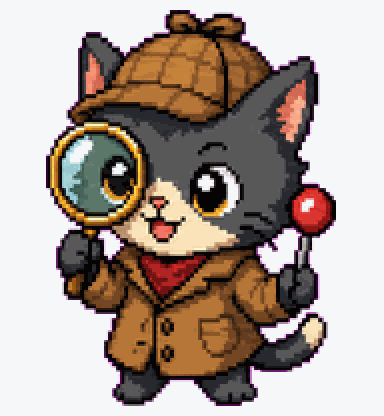
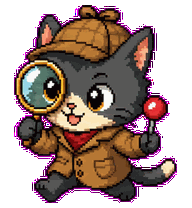
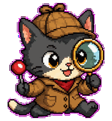
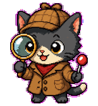
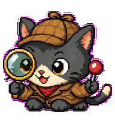
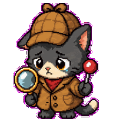
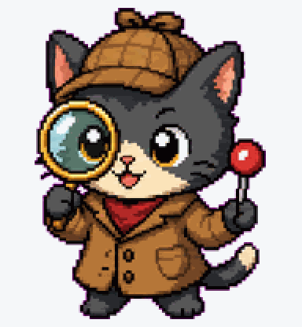
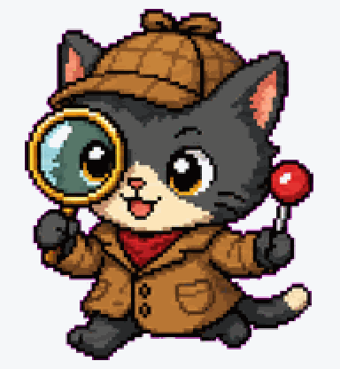
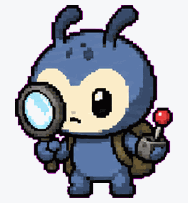

# Bug Hunter

Tiny debugging detective with a magnifying glass and breakpoint marker.



## Animation Catalog

| Idle | Running Right | Running Left |
| --- | --- | --- |
|  |  |  |

| Waving | Jumping | Failed |
| --- | --- | --- |
|  |  |  |

| Waiting | Running | Review |
| --- | --- | --- |
|  |  |  |

The full Codex install asset is [`spritesheet.webp`](spritesheet.webp). GIF previews are rendered from the committed spritesheet for GitHub review.

## Install

Copy this folder to:

```text
~/.codex/pets/bug-hunter/
```

Then open Codex App, go to `Settings > Personalization > Pets`, refresh custom pets, select `Bug Hunter`, and type `/pet`.

## Brief

Bug Hunter is an energetic developer pet for debugging vibes and bug-fixing sessions.

## States

- Idle: scans the area with a magnifying glass.
- Working: tracks a small red breakpoint marker.
- Waiting: points at a suspicious line.
- Done/review: catches the bug or stamps it fixed.

## Prompt

```text
Create an original small animated Codex pet named Bug Hunter. It is a tiny developer detective with a magnifying glass and a small red breakpoint marker, designed for debugging vibes. Style: clean 2D pixel-art sprite, readable at small size, transparent background, original character, no copyrighted references. Mood: energetic, focused, playful. Design animation-ready poses for idle scanning, actively debugging, waiting for user input, and bug-fixed success.
```

## Attribution

- Source: https://github.com/gennadi-kuzmin/awesome-codex-pets
- Creator: Gennadii Kuzmin
- License: MIT
- License copy: [gennadi-kuzmin-awesome-codex-pets-MIT.txt](../../licenses/gennadi-kuzmin-awesome-codex-pets-MIT.txt)
