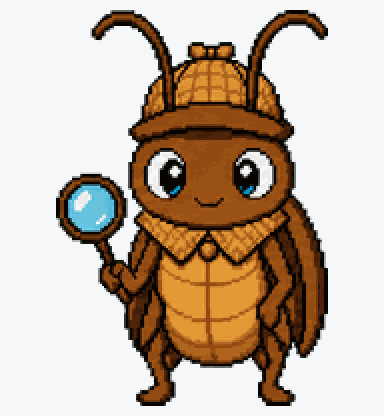
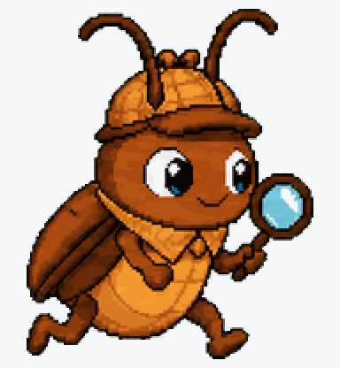
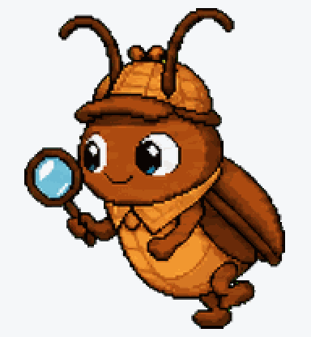
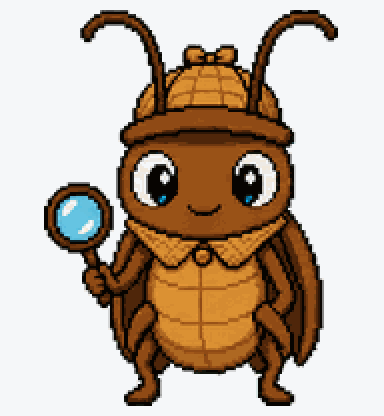
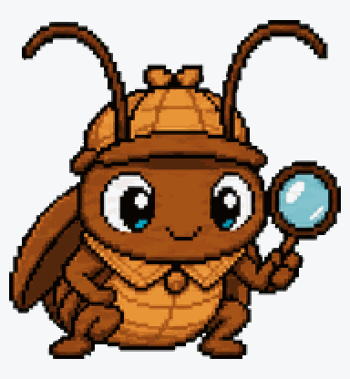
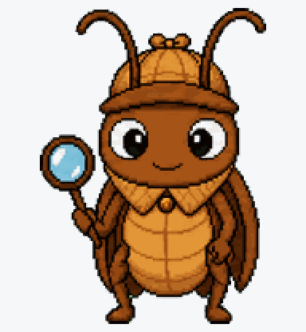
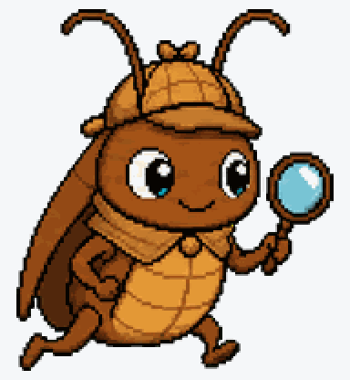
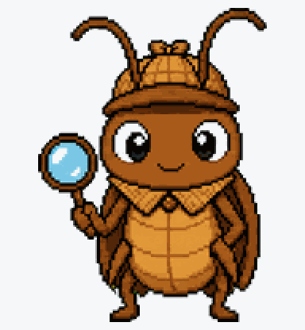

# Bug Searcher

A cute debugging cockroach detective that searches for bugs with a magnifying glass.



## Animation Catalog

| Idle | Running Right | Running Left |
| --- | --- | --- |
|  |  |  |

| Waving | Jumping | Failed |
| --- | --- | --- |
|  |  |  |

| Waiting | Running | Review |
| --- | --- | --- |
|  |  |  |

The full Codex install asset is [`spritesheet.webp`](spritesheet.webp). GIF previews are rendered from the committed spritesheet for GitHub review.

## Install

Copy this folder to:

```text
~/.codex/pets/bug-searcher/
```

Then open Codex App, go to `Settings > Personalization > Pets`, refresh custom pets, select `Bug Searcher`, and type `/pet`.

## Brief

Bug Searcher is a simplified cockroach detective with a warm-brown body, tiny cap, long antennae, expressive eyes, and a cyan-highlight magnifying glass.

## States

- Idle: stands ready with the magnifying glass.
- Running: scurries while keeping detective identity.
- Waiting: watches patiently for the next clue.
- Review: inspects the situation with suspicious focus.

## Attribution

- Source: https://github.com/gennadi-kuzmin/awesome-codex-pets
- Creator: Gennadii Kuzmin
- License: MIT
- License copy: [gennadi-kuzmin-awesome-codex-pets-MIT.txt](../../licenses/gennadi-kuzmin-awesome-codex-pets-MIT.txt)
