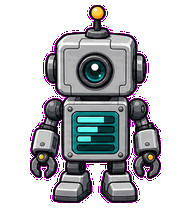
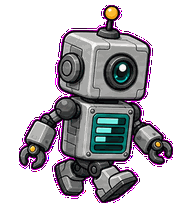
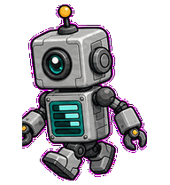
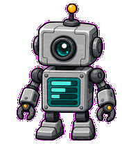
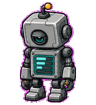
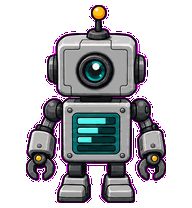
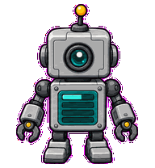

# Build Bot

A tiny build robot whose chest panel and antenna show build progress, input,
and failure.



## Animation Catalog

| Idle | Running Right | Running Left |
| --- | --- | --- |
|  |  |  |

| Waving | Jumping | Failed |
| --- | --- | --- |
|  |  |  |

| Waiting | Running | Review |
| --- | --- | --- |
|  |  |  |

The full Codex install asset is [`spritesheet.webp`](spritesheet.webp). GIF previews are rendered from the committed spritesheet for GitHub review.

## Install

```bash
mkdir -p ~/.codex/pets
cp -R pets/build-bot ~/.codex/pets/
```

Then refresh custom pets in Codex and select `Build Bot`.

## Motion Notes

- `waiting`: freezes with one antenna upright and the chest panel paused mid-fill.
- `running`: fills chest-panel bars while its arms lock and release.
- `review`: leans its head lens forward while arms brace at its sides.
- `failed`: dims the chest panel while one arm hangs loose.

## Source

- Origin: original pet generated for Familiars.
- Author: Jorge Alcantara / Zentrik.
- License: MIT for this pet bundle in this repository.

## Preview

Full contact sheet: [preview/contact-sheet.png](preview/contact-sheet.png)
