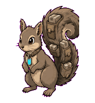
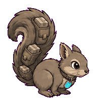
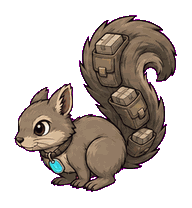
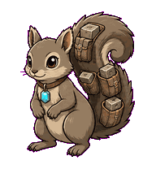
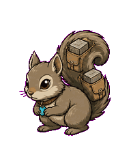
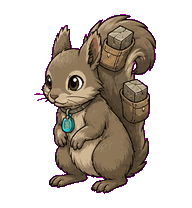
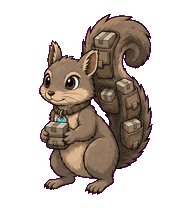
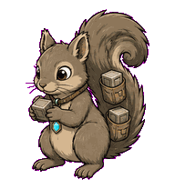
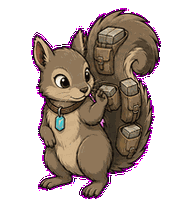

# Cache Squirrel

A dependency-cache squirrel that stashes tiny cache blocks in its tail pockets.



## Animation Catalog

| Idle | Running Right | Running Left |
| --- | --- | --- |
|  |  |  |

| Waving | Jumping | Failed |
| --- | --- | --- |
|  |  |  |

| Waiting | Running | Review |
| --- | --- | --- |
|  |  |  |

The full Codex install asset is [`spritesheet.webp`](spritesheet.webp). GIF previews are rendered from the committed spritesheet for GitHub review.

## Install

```bash
mkdir -p ~/.codex/pets
cp -R pets/cache-squirrel ~/.codex/pets/
```

Then refresh custom pets in Codex and select `Cache Squirrel`.

## Motion Notes

- `idle`: keeps a compact alert stance while the stash tail breathes lightly.
- `running-right` / `running-left`: scamper-stashes with the tail balancing each stop.
- `waving`: gives a small paw greeting without losing the cache block.
- `jumping`: makes an acorn-hop with paws tucked and tail flipping forward.
- `failed`: crouches around the stash as if the cache key missed.
- `waiting`: clutches one cache block and looks for confirmation.
- `running`: packs cache blocks into tail pockets in a quick repeatable loop.
- `review`: sniffs a cache block, then checks the stash with the tail held high.

## Source

- Origin: original pet generated for Familiars.
- Author: Jorge Alcantara / Zentrik.
- License: MIT for this pet bundle in this repository.

## Preview

Full contact sheet: [preview/contact-sheet.png](preview/contact-sheet.png)
