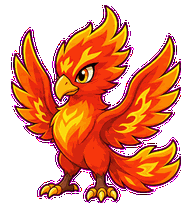
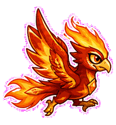
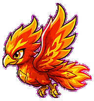
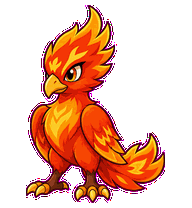
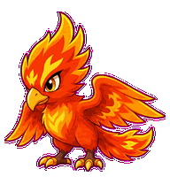
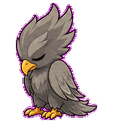
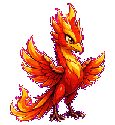
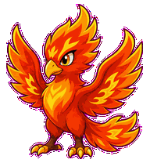
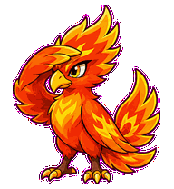

# CI Phoenix

A compact CI recovery phoenix whose attached flame-feathers rebuild from
failure into passing checks.



## Animation Catalog

| Idle | Running Right | Running Left |
| --- | --- | --- |
|  |  |  |

| Waving | Jumping | Failed |
| --- | --- | --- |
|  |  |  |

| Waiting | Running | Review |
| --- | --- | --- |
|  |  |  |

The full Codex install asset is [`spritesheet.webp`](spritesheet.webp). GIF previews are rendered from the committed spritesheet for GitHub review.

## Install

```bash
mkdir -p ~/.codex/pets
cp -R pets/ci-phoenix ~/.codex/pets/
```

Then refresh custom pets in Codex and select `CI Phoenix`.

## Motion Notes

- `waiting`: holds a paused-check posture with wings half-open.
- `running`: pulses build energy through attached flame-feathers.
- `review`: leans into the result with one wing shielding its eyes.
- `failed`: folds into an ash-gray hunch before one attached ember returns.

## Source

- Origin: original pet generated for Familiars.
- Author: Jorge Alcantara / Zentrik.
- License: MIT for this pet bundle in this repository.

## Preview

Full contact sheet: [preview/contact-sheet.png](preview/contact-sheet.png)
