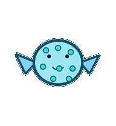
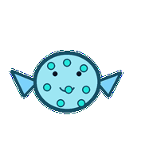
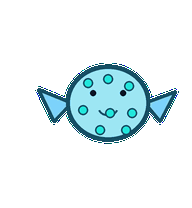
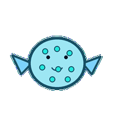
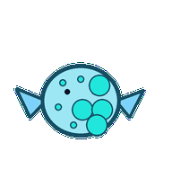
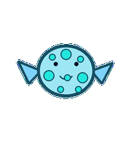
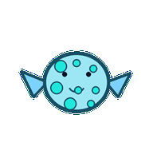
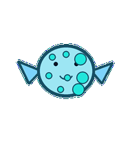

# Cluster Puffer

A scheduler puffer whose body spots inflate in balanced groups instead of copying any cluster logo.



## Animation Catalog

| Idle | Running Right | Running Left |

| --- | --- | --- |

|  |  |  |


| Waving | Jumping | Failed |

| --- | --- | --- |

|  |  |  |


| Waiting | Running | Review |

| --- | --- | --- |

|  |  |  |


The full Codex install asset is [`spritesheet.webp`](spritesheet.webp). GIF previews are rendered from the committed spritesheet for GitHub review.

## Install

```bash
mkdir -p ~/.codex/pets
cp -R pets/cluster-puffer ~/.codex/pets/
```

Then refresh custom pets in Codex and select `Cluster Puffer`.

## Motion Notes

- `idle`: drifts in place with balanced node-spots breathing evenly.

- `running-right`: drifts right with tiny fin corrections like load being rebalanced.

- `running-left`: drifts left with the same controlled scheduler corrections.

- `waving`: tilts a fin in a small hello while the spots stay balanced.

- `jumping`: inflates, rises gently, then deflates back to baseline.

- `failed`: becomes lopsided as one group of spots over-inflates and fins tuck close.

- `waiting`: holds three half-inflated spots, visibly asking where capacity should go.

- `running`: pulses spots in balanced groups as if placing work across nodes.

- `review`: rolls slightly to expose one balanced spot group for inspection.

## Source

- Origin: original pet generated for Familiars.

- Author: Jorge Alcantara / Zentrik.

- License: MIT for this pet bundle in this repository.

## Preview

Full contact sheet: [preview/contact-sheet.png](preview/contact-sheet.png)
