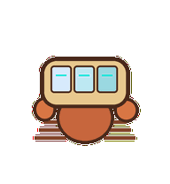
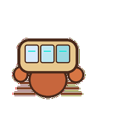
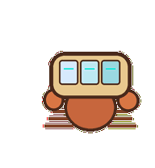
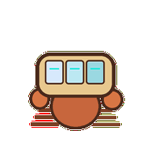
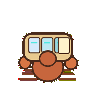
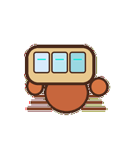

# Container Hermit

A local-services hermit crab whose compartment shell starts, stops, and settles one module at a time.



## Animation Catalog

| Idle | Running Right | Running Left |

| --- | --- | --- |

|  |  |  |


| Waving | Jumping | Failed |

| --- | --- | --- |

|  |  |  |


| Waiting | Running | Review |

| --- | --- | --- |

|  |  |  |


The full Codex install asset is [`spritesheet.webp`](spritesheet.webp). GIF previews are rendered from the committed spritesheet for GitHub review.

## Install

```bash
mkdir -p ~/.codex/pets
cp -R pets/container-hermit ~/.codex/pets/
```

Then refresh custom pets in Codex and select `Container Hermit`.

## Motion Notes

- `idle`: keeps a modular shell steady while small legs make tiny service-ready adjustments.

- `running-right`: shuffles sideways right, fast legs under a stable compartment shell.

- `running-left`: shuffles sideways left with the shell staying readable as one protected unit.

- `waving`: opens one claw while the shell compartments remain locked in place.

- `jumping`: lifts the shell as a single protected stack, then settles all panels together.

- `failed`: misaligns the shell panels and tucks halfway inside.

- `waiting`: half-hides with one claw holding a compartment open for the user's decision.

- `running`: opens, closes, and settles attached shell panels like local services starting.

- `review`: turns the shell side-on so the compartment order can be inspected.

## Source

- Origin: original pet generated for Familiars.

- Author: Jorge Alcantara / Zentrik.

- License: MIT for this pet bundle in this repository.

## Preview

Full contact sheet: [preview/contact-sheet.png](preview/contact-sheet.png)
