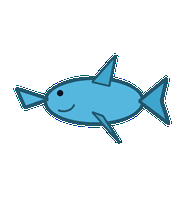
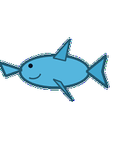
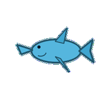
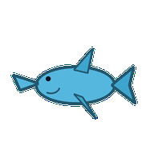
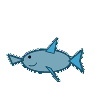
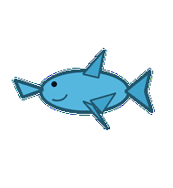
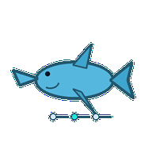
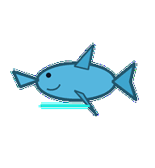

# Demo Dolphin

A product-demo dolphin that presents story beats with smooth, restrained showmanship.



## Animation Catalog

| Idle | Running Right | Running Left |

| --- | --- | --- |

|  |  |  |


| Waving | Jumping | Failed |

| --- | --- | --- |

|  |  |  |


| Waiting | Running | Review |

| --- | --- | --- |

|  |  |  |


The full Codex install asset is [`spritesheet.webp`](spritesheet.webp). GIF previews are rendered from the committed spritesheet for GitHub review.

## Install

```bash
mkdir -p ~/.codex/pets
cp -R pets/demo-dolphin ~/.codex/pets/
```

Then refresh custom pets in Codex and select `Demo Dolphin`.

## Motion Notes

- `idle`: air-swims smoothly with the nose held like a presenter ready to begin.

- `running-right`: swims right in a clean demo arc, tail steady and confident.

- `running-left`: swims left in the same calm presenter cadence.

- `waving`: tips one fin as if moving to the next slide.

- `jumping`: makes a graceful arc with a tiny tail tuck at the peak.

- `failed`: lets the nose dip and fins fold close as the demo arc sinks.

- `waiting`: hovers with one fin held in ready-to-show posture.

- `running`: points through attached story-beat ridges while keeping the movement polished.

- `review`: turns side-on as if presenting the final outcome for inspection.

## Source

- Origin: original pet generated for Familiars.

- Author: Jorge Alcantara / Zentrik.

- License: MIT for this pet bundle in this repository.

## Preview

Full contact sheet: [preview/contact-sheet.png](preview/contact-sheet.png)
