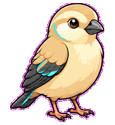
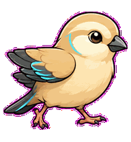
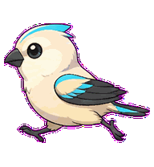
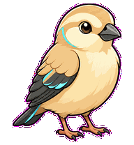
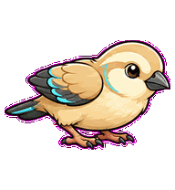
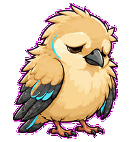
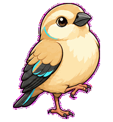
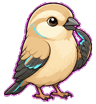
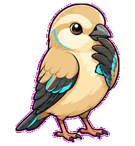

# Design Finch

A UI QA finch that measures spacing and nudges alignment with tiny precise hops.



## Animation Catalog

| Idle | Running Right | Running Left |
| --- | --- | --- |
|  |  |  |

| Waving | Jumping | Failed |
| --- | --- | --- |
|  |  |  |

| Waiting | Running | Review |
| --- | --- | --- |
|  |  |  |

The full Codex install asset is [`spritesheet.webp`](spritesheet.webp). GIF previews are rendered from the committed spritesheet for GitHub review.

## Install

```bash
mkdir -p ~/.codex/pets
cp -R pets/design-finch ~/.codex/pets/
```

Then refresh custom pets in Codex and select `Design Finch`.

## Motion Notes

- `idle`: breathes with tiny feather and beak micro-motion.
- `running-right` / `running-left`: hops precisely between layout breakpoints.
- `waving`: greets through a small wing lift.
- `jumping`: performs a tight breakpoint hop with wings tucked, then balances.
- `failed`: fluffs unevenly like broken spacing.
- `waiting`: balances on one foot, waiting for the visual decision.
- `running`: measures invisible spacing with wing tips while the beak nudges alignment.
- `review`: points its beak along an invisible baseline in a held inspection stance.

## Source

- Origin: original pet generated for Familiars.
- Author: Jorge Alcantara / Zentrik.
- License: MIT for this pet bundle in this repository.

## Preview

Full contact sheet: [preview/contact-sheet.png](preview/contact-sheet.png)
