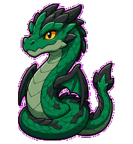
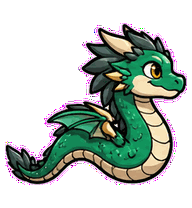
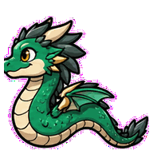
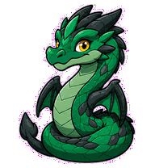
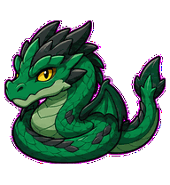
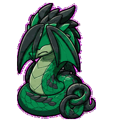
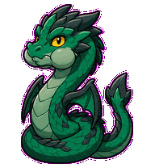
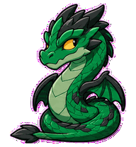
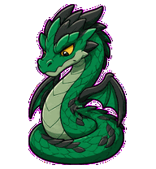

# Diff Dragon

A restrained large-diff dragon that scans changes with its eyes and marks
review targets with its tail.



## Animation Catalog

| Idle | Running Right | Running Left |
| --- | --- | --- |
|  |  |  |

| Waving | Jumping | Failed |
| --- | --- | --- |
|  |  |  |

| Waiting | Running | Review |
| --- | --- | --- |
|  |  |  |

The full Codex install asset is [`spritesheet.webp`](spritesheet.webp). GIF previews are rendered from the committed spritesheet for GitHub review.

## Install

```bash
mkdir -p ~/.codex/pets
cp -R pets/diff-dragon ~/.codex/pets/
```

Then refresh custom pets in Codex and select `Diff Dragon`.

## Motion Notes

- `waiting`: holds its breath with puffed cheeks before commenting.
- `running`: scans an invisible split diff while its tail marks the changed line.
- `review`: tracks line by line with its snout and tail tip.
- `failed`: folds its wings over its face while the tail tightens into a review knot.

## Source

- Origin: original pet generated for Familiars.
- Author: Jorge Alcantara / Zentrik.
- License: MIT for this pet bundle in this repository.

## Preview

Full contact sheet: [preview/contact-sheet.png](preview/contact-sheet.png)
