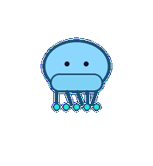
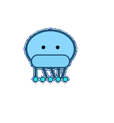
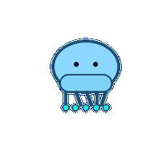
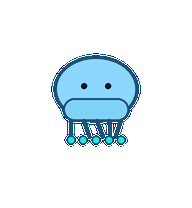
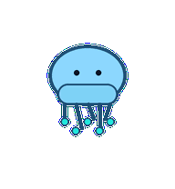
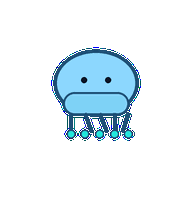

# Docs Jelly

A documentation jelly whose bell and tendrils organize rough knowledge into readable structure.



## Animation Catalog

| Idle | Running Right | Running Left |

| --- | --- | --- |

|  |  |  |


| Waving | Jumping | Failed |

| --- | --- | --- |

|  |  |  |


| Waiting | Running | Review |

| --- | --- | --- |

|  |  |  |


The full Codex install asset is [`spritesheet.webp`](spritesheet.webp). GIF previews are rendered from the committed spritesheet for GitHub review.

## Install

```bash
mkdir -p ~/.codex/pets
cp -R pets/docs-jelly ~/.codex/pets/
```

Then refresh custom pets in Codex and select `Docs Jelly`.

## Motion Notes

- `idle`: floats with a quiet bell pulse and relaxed paragraph-like tendrils.

- `running-right`: drifts right with tendrils trailing in ordered lines.

- `running-left`: drifts left with tendrils trailing in ordered lines.

- `waving`: lifts one tendril in a soft documentation hello.

- `jumping`: contracts upward instead of jumping, then descends softly.

- `failed`: tendrils tangle while the bell flattens slightly.

- `waiting`: pauses mid-pulse with tendrils held like an unfinished sentence.

- `running`: aligns tendrils into neat rows, then relaxes them.

- `review`: tilts its bell and underlines an invisible sentence with attached tendrils.

## Source

- Origin: original pet generated for Familiars.

- Author: Jorge Alcantara / Zentrik.

- License: MIT for this pet bundle in this repository.

## Preview

Full contact sheet: [preview/contact-sheet.png](preview/contact-sheet.png)
