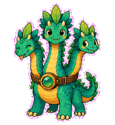
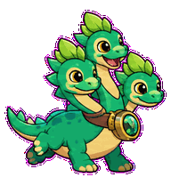
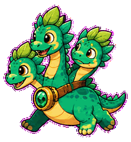
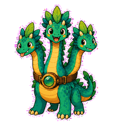
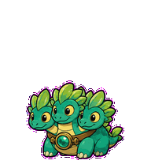
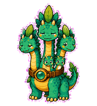
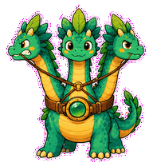
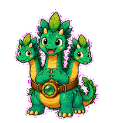
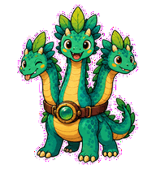

# Feature Hydra

A charming product hydra whose feature heads regrow when scope is cut badly.



## Animation Catalog

| Idle | Running Right | Running Left |
| --- | --- | --- |
|  |  |  |

| Waving | Jumping | Failed |
| --- | --- | --- |
|  |  |  |

| Waiting | Running | Review |
| --- | --- | --- |
|  |  |  |

The full Codex install asset is [`spritesheet.webp`](spritesheet.webp). GIF previews are rendered from the committed spritesheet for GitHub review.

## Install

```bash
mkdir -p ~/.codex/pets
cp -R pets/feature-hydra ~/.codex/pets/
```

Then refresh custom pets in Codex and select `Feature Hydra`.

## Motion Notes

- `waiting`: pulls its heads in different directions while one head asks for the cut.
- `running`: re-ranks the heads so one feature leads and the others tuck back.
- `review`: settles into one leading head with calm support heads.
- `failed`: sprouts extra attached feature heads until the body is overcrowded.

## Source

- Origin: original pet generated for Familiars.
- Author: Jorge Alcantara / Zentrik.
- License: MIT for this pet bundle in this repository.

## Preview

Full contact sheet: [preview/contact-sheet.png](preview/contact-sheet.png)
