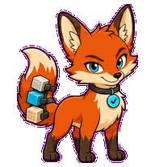
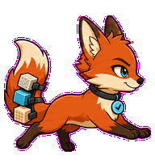
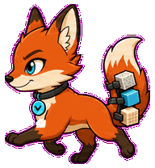
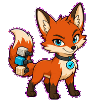
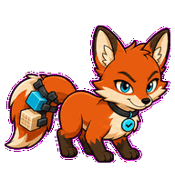
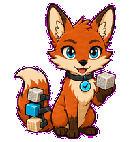
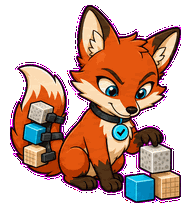
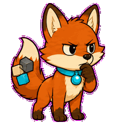

# Fixture Fox

A test-fixture fox that arranges attached sample blocks with clever paw work.



## Animation Catalog

| Idle | Running Right | Running Left |
| --- | --- | --- |
|  |  |  |

| Waving | Jumping | Failed |
| --- | --- | --- |
|  |  |  |

| Waiting | Running | Review |
| --- | --- | --- |
|  |  |  |

The full Codex install asset is [`spritesheet.webp`](spritesheet.webp). GIF previews are rendered from the committed spritesheet for GitHub review.

## Install

```bash
mkdir -p ~/.codex/pets
cp -R pets/fixture-fox ~/.codex/pets/
```

Then refresh custom pets in Codex and select `Fixture Fox`.

## Motion Notes

- `idle`: keeps its sample blocks tucked into the tail with a sly ear twitch.
- `running-right` / `running-left`: trots with the tail carrying attached fixture blocks.
- `waving`: acknowledges with one paw while the fixture tail stays balanced.
- `jumping`: bounds quickly and tucks the fixture blocks close midair.
- `failed`: lets the tail spill inward while the ears tilt back.
- `waiting`: holds one fixture block in paw with ears forward.
- `running`: arranges attached sample blocks with its paws, then checks their order.
- `review`: points nose-to-fixture in a tidy verification rhythm.

## Source

- Origin: original pet generated for Familiars.
- Author: Jorge Alcantara / Zentrik.
- License: MIT for this pet bundle in this repository.

## Preview

Full contact sheet: [preview/contact-sheet.png](preview/contact-sheet.png)
