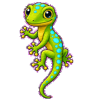
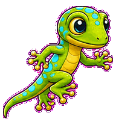
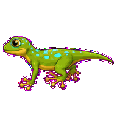
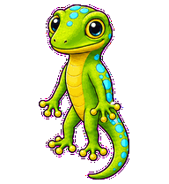
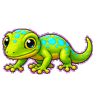
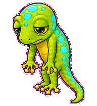
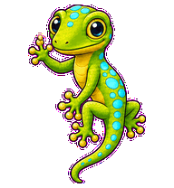
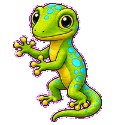
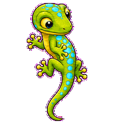

# Goroutine Gecko

A service-concurrency gecko whose sticky toes and staggered spots keep parallel work coordinated.



## Animation Catalog

| Idle | Running Right | Running Left |
| --- | --- | --- |
|  |  |  |

| Waving | Jumping | Failed |
| --- | --- | --- |
|  |  |  |

| Waiting | Running | Review |
| --- | --- | --- |
|  |  |  |

The full Codex install asset is [`spritesheet.webp`](spritesheet.webp). GIF previews are rendered from the committed spritesheet for GitHub review.

## Install

```bash
mkdir -p ~/.codex/pets
cp -R pets/goroutine-gecko ~/.codex/pets/
```

Then refresh custom pets in Codex and select `Goroutine Gecko`.

## Motion Notes

- `idle`: waits in a calm scheduler pose with tiny toe and tail timing.
- `running-right` / `running-left`: moves through coordinated sticky-toe footfalls.
- `waving`: greets with a raised sticky toe and balanced tail.
- `jumping`: pops upward through sequential toe lift and tail balance.
- `failed`: splays toes in mismatched timing while the tail drops out of sync.
- `waiting`: freezes with one toe raised and the tail held like a paused channel.
- `running`: taps through parallel service checks while body spots pulse in staggered lanes.
- `review`: pivots between body spots to check handoff order.

## Source

- Origin: original pet generated for Familiars.
- Author: Jorge Alcantara / Zentrik.
- License: MIT for this pet bundle in this repository.

## Preview

Full contact sheet: [preview/contact-sheet.png](preview/contact-sheet.png)
