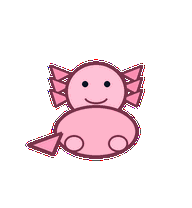
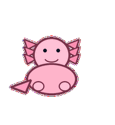
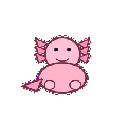
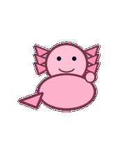
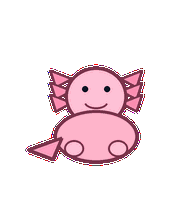
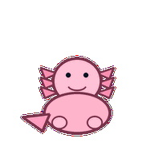
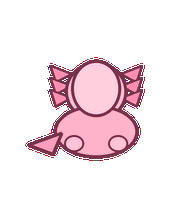
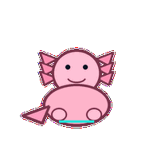

# Incident Axolotl

A calm incident responder whose frills pulse like steady breathing during escalation and recovery.



## Animation Catalog

| Idle | Running Right | Running Left |

| --- | --- | --- |

|  |  |  |


| Waving | Jumping | Failed |

| --- | --- | --- |

|  |  |  |


| Waiting | Running | Review |

| --- | --- | --- |

|  |  |  |


The full Codex install asset is [`spritesheet.webp`](spritesheet.webp). GIF previews are rendered from the committed spritesheet for GitHub review.

## Install

```bash
mkdir -p ~/.codex/pets
cp -R pets/incident-axolotl ~/.codex/pets/
```

Then refresh custom pets in Codex and select `Incident Axolotl`.

## Motion Notes

- `idle`: breathes slowly with symmetrical frill pulses.

- `running-right`: takes gentle amphibian steps to the right with composed eyes.

- `running-left`: takes gentle amphibian steps to the left with the same calm cadence.

- `waving`: raises one paw without breaking incident-room composure.

- `jumping`: makes a soft waterless bounce while frills fold in and out.

- `failed`: frills droop and the body lowers, but the posture stays composed.

- `waiting`: holds steady eye contact with frills low, asking for the escalation choice.

- `running`: moves paws through response steps while frills pulse in a slower rhythm.

- `review`: lowers its head and aligns frills into a tidy post-incident shape.

## Source

- Origin: original pet generated for Familiars.

- Author: Jorge Alcantara / Zentrik.

- License: MIT for this pet bundle in this repository.

## Preview

Full contact sheet: [preview/contact-sheet.png](preview/contact-sheet.png)
