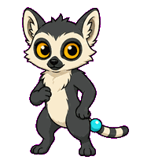
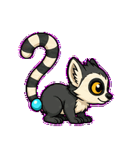
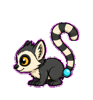
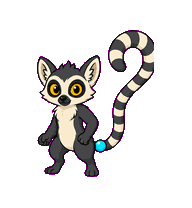
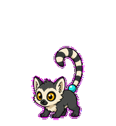
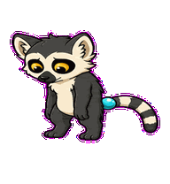
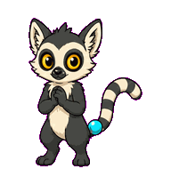
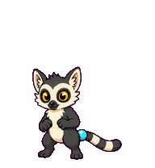
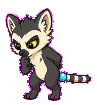

# Latency Lemur

A performance lemur whose striped tail behaves like a tiny timing graph.



## Animation Catalog

| Idle | Running Right | Running Left |
| --- | --- | --- |
|  |  |  |

| Waving | Jumping | Failed |
| --- | --- | --- |
|  |  |  |

| Waiting | Running | Review |
| --- | --- | --- |
|  |  |  |

The full Codex install asset is [`spritesheet.webp`](spritesheet.webp). GIF previews are rendered from the committed spritesheet for GitHub review.

## Install

```bash
mkdir -p ~/.codex/pets
cp -R pets/latency-lemur ~/.codex/pets/
```

Then refresh custom pets in Codex and select `Latency Lemur`.

## Motion Notes

- `idle`: holds an alert pose while the tail keeps a quiet measurement rhythm.
- `running-right` / `running-left`: hops with the striped tail acting as the timing trace.
- `waving`: gives a small lemur-hand hello while the tail stays visible.
- `jumping`: snaps into a vertical reaction hop with a tail-spike silhouette.
- `failed`: lets the timing tail droop into a long slow curve.
- `waiting`: freezes at a mid-height tail reading and waits for input.
- `running`: ticks the tail through low, high, and tail-latency-like heights.
- `review`: leans forward with the tail held straight as a measured baseline.

## Source

- Origin: original pet generated for Familiars.
- Author: Jorge Alcantara / Zentrik.
- License: MIT for this pet bundle in this repository.

## Preview

Full contact sheet: [preview/contact-sheet.png](preview/contact-sheet.png)
