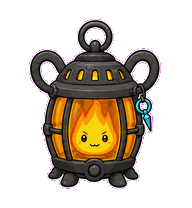
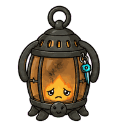

# Launch Lantern

A launch-readiness pet that turns go-to-market confidence into a flame that
must be protected and tuned.



## Animation Catalog

| Idle | Running Right | Running Left |
| --- | --- | --- |
|  |  |  |

| Waving | Jumping | Failed |
| --- | --- | --- |
|  |  |  |

| Waiting | Running | Review |
| --- | --- | --- |
|  |  |  |

The full Codex install asset is [`spritesheet.webp`](spritesheet.webp). GIF previews are rendered from the committed spritesheet for GitHub review.

## Install

```bash
mkdir -p ~/.codex/pets
cp -R pets/launch-lantern ~/.codex/pets/
```

Then refresh custom pets in Codex and select `Launch Lantern`.

## Motion Notes

- `idle`: keeps a low, steady flame pulsing behind the glass.
- `running-right` / `running-left`: carries the flame while the frame shields it.
- `waving`: opens a hinged shutter as a lantern greeting.
- `jumping`: makes a careful hop while the flame stretches inside the glass.
- `failed`: gutters behind soot-marked glass without detached smoke.
- `waiting`: half-closes its shutter around a cautious launch flame.
- `running`: tunes the wick from nervous flicker into controlled launch glow.
- `review`: holds a compact steady flame, ready to ship.

## Source

- Origin: original pet generated for Familiars.
- Author: Jorge Alcantara / Zentrik.
- License: MIT for this pet bundle in this repository.

## Preview

Full contact sheet: [preview/contact-sheet.png](preview/contact-sheet.png)
