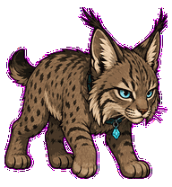
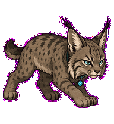
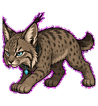
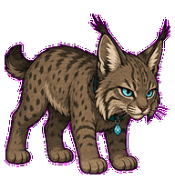
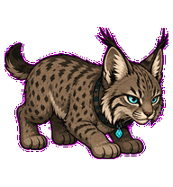
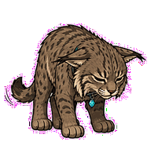
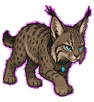
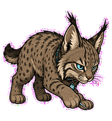
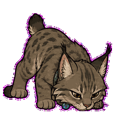

# Log Lynx

A quiet log-scanning lynx whose ear tufts and paw pauses find the exact line.



## Animation Catalog

| Idle | Running Right | Running Left |
| --- | --- | --- |
|  |  |  |

| Waving | Jumping | Failed |
| --- | --- | --- |
|  |  |  |

| Waiting | Running | Review |
| --- | --- | --- |
|  |  |  |

The full Codex install asset is [`spritesheet.webp`](spritesheet.webp). GIF previews are rendered from the committed spritesheet for GitHub review.

## Install

```bash
mkdir -p ~/.codex/pets
cp -R pets/log-lynx ~/.codex/pets/
```

Then refresh custom pets in Codex and select `Log Lynx`.

## Motion Notes

- `idle`: crouches low with ear-tuft micro-movement, ready to listen.
- `running-right` / `running-left`: prowls silently, ears leading each direction change.
- `waving`: gives a small paw-and-ear acknowledgement without breaking focus.
- `jumping`: makes a quiet pounce-hop with shoulders leading.
- `failed`: flattens the ears and lets one tail lash show the missed line.
- `waiting`: points one ear at the user while staying low.
- `running`: scans horizontally with narrowed eyes, triangulating ears, and one paw pause.
- `review`: lowers its nose to the exact invisible log line.

## Source

- Origin: original pet generated for Familiars.
- Author: Jorge Alcantara / Zentrik.
- License: MIT for this pet bundle in this repository.

## Preview

Full contact sheet: [preview/contact-sheet.png](preview/contact-sheet.png)
