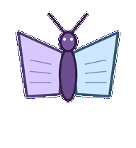
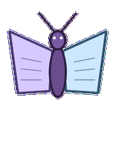
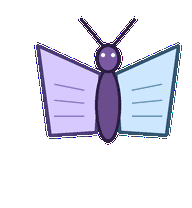
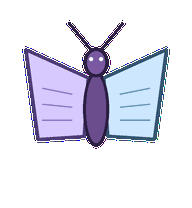
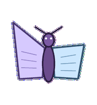
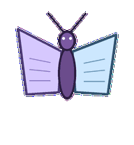

# Meeting Moth

A transcript moth whose wings fold from chatter into a tidy summary shape.



## Animation Catalog

| Idle | Running Right | Running Left |

| --- | --- | --- |

|  |  |  |


| Waving | Jumping | Failed |

| --- | --- | --- |

|  |  |  |


| Waiting | Running | Review |

| --- | --- | --- |

|  |  |  |


The full Codex install asset is [`spritesheet.webp`](spritesheet.webp). GIF previews are rendered from the committed spritesheet for GitHub review.

## Install

```bash
mkdir -p ~/.codex/pets
cp -R pets/meeting-moth ~/.codex/pets/
```

Then refresh custom pets in Codex and select `Meeting Moth`.

## Motion Notes

- `idle`: flutters softly around an invisible note line with calm antennae.

- `running-right`: drifts right with alternating wings in turn-taking rhythm.

- `running-left`: drifts left with the same speaker-capture rhythm.

- `waving`: lifts one wing like acknowledging the next speaker.

- `jumping`: rises on a wingbeat while antennae stay aimed at the speaker.

- `failed`: folds both wings down and lets antennae droop.

- `waiting`: pauses mid-flutter as if the room has gone silent.

- `running`: opens and closes wings in speaker turns while lines collect on the wing panels.

- `review`: flattens wings into two summary pages and aligns both antennae.

## Source

- Origin: original pet generated for Familiars.

- Author: Jorge Alcantara / Zentrik.

- License: MIT for this pet bundle in this repository.

## Preview

Full contact sheet: [preview/contact-sheet.png](preview/contact-sheet.png)
