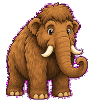
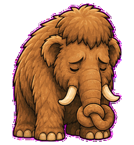
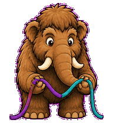
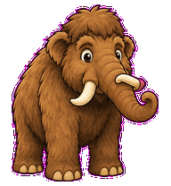

# Merge Mammoth

A huge but gentle merge-conflict mammoth that untangles branches with patient
trunk work.



## Animation Catalog

| Idle | Running Right | Running Left |
| --- | --- | --- |
|  |  |  |

| Waving | Jumping | Failed |
| --- | --- | --- |
|  |  |  |

| Waiting | Running | Review |
| --- | --- | --- |
|  |  |  |

The full Codex install asset is [`spritesheet.webp`](spritesheet.webp). GIF previews are rendered from the committed spritesheet for GitHub review.

## Install

```bash
mkdir -p ~/.codex/pets
cp -R pets/merge-mammoth ~/.codex/pets/
```

Then refresh custom pets in Codex and select `Merge Mammoth`.

## Motion Notes

- `waiting`: offers an invisible conflict strand for the user to choose.
- `running`: pulls attached strands together and smooths them into one path.
- `review`: peers over one tusk while tracing a careful diff boundary.
- `failed`: folds into a heavy wool slump with the trunk knotted low.

## Source

- Origin: original pet generated for Familiars.
- Author: Jorge Alcantara / Zentrik.
- License: MIT for this pet bundle in this repository.

## Preview

Full contact sheet: [preview/contact-sheet.png](preview/contact-sheet.png)
