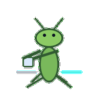
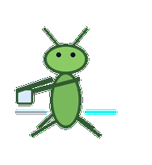
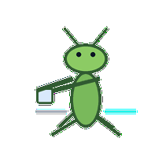
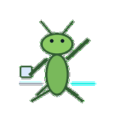
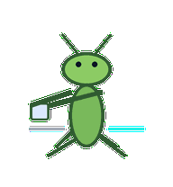
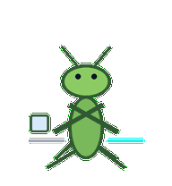
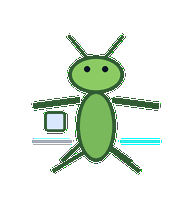
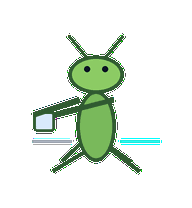
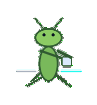

# Migration Mantis

A precise migration mantis that moves one attached block from old path to new path with surgical care.



## Animation Catalog

| Idle | Running Right | Running Left |

| --- | --- | --- |

|  |  |  |


| Waving | Jumping | Failed |

| --- | --- | --- |

|  |  |  |


| Waiting | Running | Review |

| --- | --- | --- |

|  |  |  |


The full Codex install asset is [`spritesheet.webp`](spritesheet.webp). GIF previews are rendered from the committed spritesheet for GitHub review.

## Install

```bash
mkdir -p ~/.codex/pets
cp -R pets/migration-mantis ~/.codex/pets/
```

Then refresh custom pets in Codex and select `Migration Mantis`.

## Motion Notes

- `idle`: stands angular and still with forearms folded like staged migration steps.

- `running-right`: steps right with precise mantis foot placement and folded forearms.

- `running-left`: steps left with the same careful cutover cadence.

- `waving`: opens one forearm in a sharp acknowledgement.

- `jumping`: hops in an angular shape with both forearms tucked close.

- `failed`: crosses its forearms and locks up in a failed cutover posture.

- `waiting`: holds both forearms apart, waiting for the cutover choice.

- `running`: moves one attached block from old side to new side, then checks it.

- `review`: traces the new path with a forearm tip and narrow focus.

## Source

- Origin: original pet generated for Familiars.

- Author: Jorge Alcantara / Zentrik.

- License: MIT for this pet bundle in this repository.

## Preview

Full contact sheet: [preview/contact-sheet.png](preview/contact-sheet.png)
