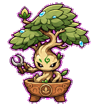
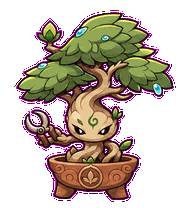
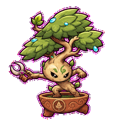
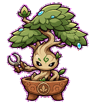
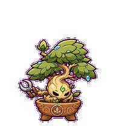
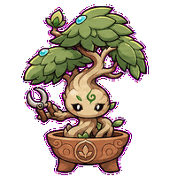
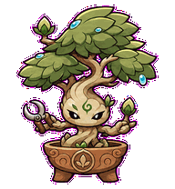
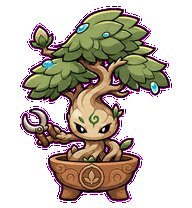
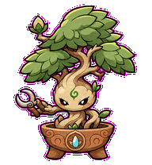

# MVP Bonsai

A disciplined little bonsai pet that shows product taste through pruning.



## Animation Catalog

| Idle | Running Right | Running Left |
| --- | --- | --- |
|  |  |  |

| Waving | Jumping | Failed |
| --- | --- | --- |
|  |  |  |

| Waiting | Running | Review |
| --- | --- | --- |
|  |  |  |

The full Codex install asset is [`spritesheet.webp`](spritesheet.webp). GIF previews are rendered from the committed spritesheet for GitHub review.

## Install

```bash
mkdir -p ~/.codex/pets
cp -R pets/mvp-bonsai ~/.codex/pets/
```

Then refresh custom pets in Codex and select `MVP Bonsai`.

## Motion Notes

- `waiting`: presents one unopened bud and asks which one thing should grow next.
- `running`: tests side buds, then prunes back to the useful learning unit.
- `review`: returns to a clean pruned silhouette with the cyan dew accent centered.
- `failed`: droops under attached overgrowth while keeping the same compact bonsai identity.

## Source

- Origin: original pet generated for Familiars.
- Author: Jorge Alcantara / Zentrik.
- License: MIT for this pet bundle in this repository.

## Preview

Full contact sheet: [preview/contact-sheet.png](preview/contact-sheet.png)
