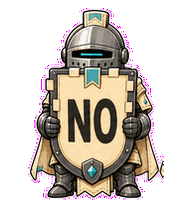
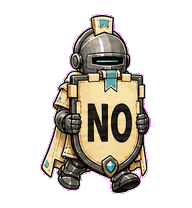
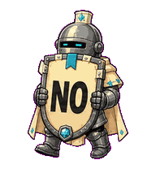
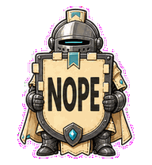
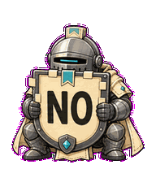
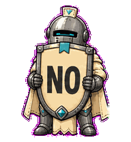
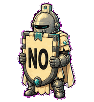
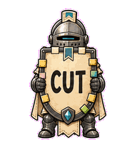
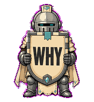

# No Knight

A tiny roadmap knight that protects focus with a giant shield-billboard. Its
default answer is `NO`, with a few dry variants for product rituals.



## Animation Catalog

| Idle | Running Right | Running Left |
| --- | --- | --- |
|  |  |  |

| Waving | Jumping | Failed |
| --- | --- | --- |
|  |  |  |

| Waiting | Running | Review |
| --- | --- | --- |
|  |  |  |

The full Codex install asset is [`spritesheet.webp`](spritesheet.webp). GIF previews are rendered from the committed spritesheet for GitHub review.

## Install

```bash
mkdir -p ~/.codex/pets
cp -R pets/no-knight ~/.codex/pets/
```

Then refresh custom pets in Codex and select `No Knight`.

## Motion Notes

- `idle`: stands still behind a large `NO`, because sometimes the roadmap has already spoken.
- `running-right` / `running-left`: marches shield-first with readable `NO` text in both directions.
- `waving`: offers a restrained gauntlet salute while the shield says `NOPE`.
- `jumping`: performs a heavy ceremonial hop without ever letting `NO` leave the shield.
- `failed`: gets crowded by attached roadmap tabs, but the `NO` survives the scope pressure.
- `waiting`: holds a bigger, slower `NO` like a meeting that should have been an email.
- `running`: trims the lane with a blunt `CUT`.
- `review`: tilts into a dry `WHY` before anything gets promoted.

## Source

- Origin: original pet generated for Familiars.
- Author: Jorge Alcantara / Zentrik.
- License: MIT for this pet bundle in this repository.

## Preview

Full contact sheet: [preview/contact-sheet.png](preview/contact-sheet.png)
