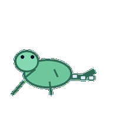
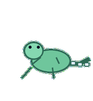
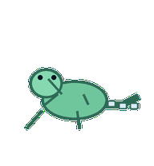
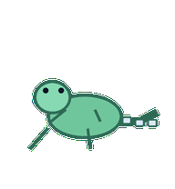
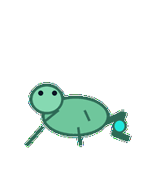
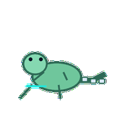

# Notebook Newt

A data notebook newt whose tail marks cell execution order and knots when results break.


## Animation Catalog

| Idle | Running Right | Running Left |

| --- | --- | --- |

|  |  |  |


| Waving | Jumping | Failed |

| --- | --- | --- |

|  |  |  |


| Waiting | Running | Review |

| --- | --- | --- |

|  |  |  |


The full Codex install asset is [`spritesheet.webp`](spritesheet.webp). GIF previews are rendered from the committed spritesheet for GitHub review.

## Install

```bash
mkdir -p ~/.codex/pets
cp -R pets/notebook-newt ~/.codex/pets/
```

Then refresh custom pets in Codex and select `Notebook Newt`.

## Motion Notes

- `idle`: rests low with its tail curled into a small sequence of notebook-cell beats.

- `running-right`: crawls right carefully, tail drawing cell-by-cell timing behind it.

- `running-left`: crawls left carefully with the same cell execution cadence.

- `waving`: raises one tiny forefoot without breaking notebook focus.

- `jumping`: makes a tiny lab-hop while the tail curls under for balance.

- `failed`: ties the tail into a small error knot and lowers the head.

- `waiting`: stops between two cell beats with head raised toward the user.

- `running`: marks execution order along the tail while checking result shapes.

- `review`: lowers its head to inspect an output-cell boundary drawn by the tail.

## Source

- Origin: original pet generated for Familiars.

- Author: Jorge Alcantara / Zentrik.

- License: MIT for this pet bundle in this repository.

## Preview

Full contact sheet: [preview/contact-sheet.png](preview/contact-sheet.png)
