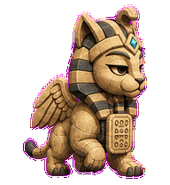

# Priority Sphinx

A tiny sphinx that blocks progress until the real tradeoff is answered.


## Animation Catalog

| Idle | Running Right | Running Left |
| --- | --- | --- |
|  |  |  |

| Waving | Jumping | Failed |
| --- | --- | --- |
|  |  |  |

| Waiting | Running | Review |
| --- | --- | --- |
|  |  |  |

The full Codex install asset is [`spritesheet.webp`](spritesheet.webp). GIF previews are rendered from the committed spritesheet for GitHub review.

## Install

```bash
mkdir -p ~/.codex/pets
cp -R pets/priority-sphinx ~/.codex/pets/
```

Then refresh custom pets in Codex and select `Priority Sphinx`.

## Motion Notes

- `waiting`: tilts its tablet toward the user and blocks until the tradeoff is named.
- `running`: simplifies abstract tablet marks while the tail settles.
- `review`: locks the tablet flat and gives a tiny solemn nod.
- `failed`: cracks the attached tablet into two halves without loose debris.

## Source

- Origin: original pet generated for Familiars.
- Author: Jorge Alcantara / Zentrik.
- License: MIT for this pet bundle in this repository.

## Preview

Full contact sheet: [preview/contact-sheet.png](preview/contact-sheet.png)
