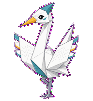
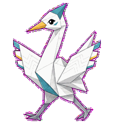
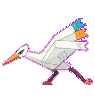
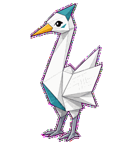
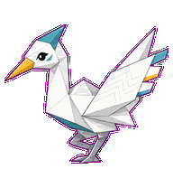
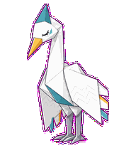
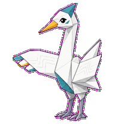
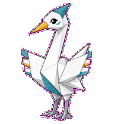
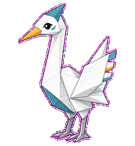

# Product Crane

A precise planning crane that organizes product intent with calm long-form
attention.



## Animation Catalog

| Idle | Running Right | Running Left |
| --- | --- | --- |
|  |  |  |

| Waving | Jumping | Failed |
| --- | --- | --- |
|  |  |  |

| Waiting | Running | Review |
| --- | --- | --- |
|  |  |  |

The full Codex install asset is [`spritesheet.webp`](spritesheet.webp). GIF previews are rendered from the committed spritesheet for GitHub review.

## Install

```bash
mkdir -p ~/.codex/pets
cp -R pets/product-crane ~/.codex/pets/
```

Then refresh custom pets in Codex and select `Product Crane`.

## Motion Notes

- `waiting`: extends an attached tabbed wing for prioritization input.
- `running`: sorts intent through head scans, wing-tab order, and a decisive nod.
- `review`: locks wing tabs into final order while inspecting the result.
- `failed`: loses tab alignment and lowers the neck without adding symbols.

## Source

- Origin: original pet generated for Familiars.
- Author: Jorge Alcantara / Zentrik.
- License: MIT for this pet bundle in this repository.

## Preview

Full contact sheet: [preview/contact-sheet.png](preview/contact-sheet.png)
