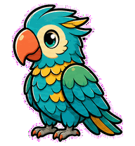
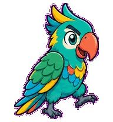
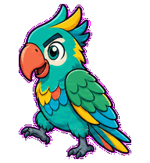
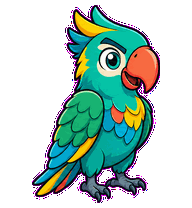
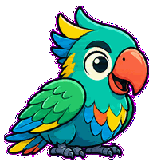
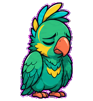
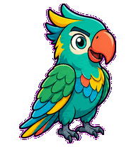
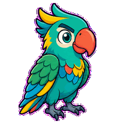
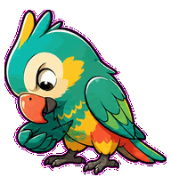

# Prompt Parrot

A prompt-refinement parrot whose beak cadence and feathers reorder ideas into
sharper instructions.



## Animation Catalog

| Idle | Running Right | Running Left |
| --- | --- | --- |
|  |  |  |

| Waving | Jumping | Failed |
| --- | --- | --- |
|  |  |  |

| Waiting | Running | Review |
| --- | --- | --- |
|  |  |  |

The full Codex install asset is [`spritesheet.webp`](spritesheet.webp). GIF previews are rendered from the committed spritesheet for GitHub review.

## Install

```bash
mkdir -p ~/.codex/pets
cp -R pets/prompt-parrot ~/.codex/pets/
```

Then refresh custom pets in Codex and select `Prompt Parrot`.

## Motion Notes

- `waiting`: cocks its head sharply, ready for the next instruction.
- `running`: opens its beak in measured beats while feathers reorder.
- `review`: points its beak down while feathers settle into final order.
- `failed`: ruffles out of order with its beak clamped shut.

## Source

- Origin: original pet generated for Familiars.
- Author: Jorge Alcantara / Zentrik.
- License: MIT for this pet bundle in this repository.

## Preview

Full contact sheet: [preview/contact-sheet.png](preview/contact-sheet.png)
