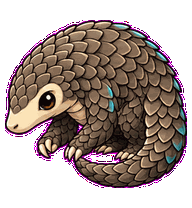
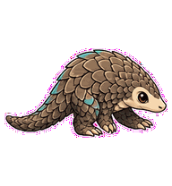
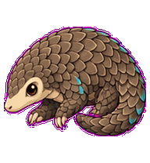
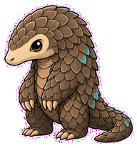
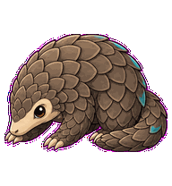
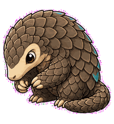
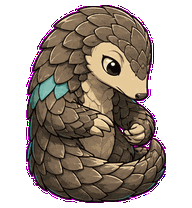

# Python Pangolin

A refactor pangolin whose scales flip in indentation-like steps while it edits.



## Animation Catalog

| Idle | Running Right | Running Left |
| --- | --- | --- |
|  |  |  |

| Waving | Jumping | Failed |
| --- | --- | --- |
|  |  |  |

| Waiting | Running | Review |
| --- | --- | --- |
|  |  |  |

The full Codex install asset is [`spritesheet.webp`](spritesheet.webp). GIF previews are rendered from the committed spritesheet for GitHub review.

## Install

```bash
mkdir -p ~/.codex/pets
cp -R pets/python-pangolin ~/.codex/pets/
```

Then refresh custom pets in Codex and select `Python Pangolin`.

## Motion Notes

- `idle`: keeps a compact curl while the scale line breathes subtly.
- `running-right` / `running-left`: travels through curl-unroll steps and scale ripples.
- `waving`: gives a tiny claw greeting from a half-curled posture.
- `jumping`: curls into a ball, lifts slightly, then unrolls into landing.
- `failed`: locks into a protective ball with only the snout visible.
- `waiting`: half-curls with one eye visible for import direction.
- `running`: flips scales in indentation-like steps while tiny claws edit.
- `review`: uncurls just enough to inspect scale alignment.

## Source

- Origin: original pet generated for Familiars.
- Author: Jorge Alcantara / Zentrik.
- License: MIT for this pet bundle in this repository.

## Preview

Full contact sheet: [preview/contact-sheet.png](preview/contact-sheet.png)
