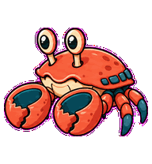
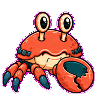
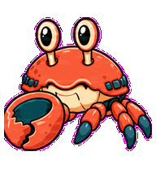
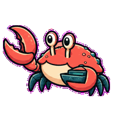
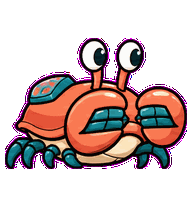
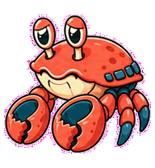
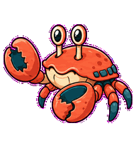
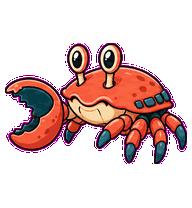
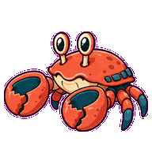

# Queue Crab

A sideways job-queue crab whose claws track pending work and pull tasks into
motion.



## Animation Catalog

| Idle | Running Right | Running Left |
| --- | --- | --- |
|  |  |  |

| Waving | Jumping | Failed |
| --- | --- | --- |
|  |  |  |

| Waiting | Running | Review |
| --- | --- | --- |
|  |  |  |

The full Codex install asset is [`spritesheet.webp`](spritesheet.webp). GIF previews are rendered from the committed spritesheet for GitHub review.

## Install

```bash
mkdir -p ~/.codex/pets
cp -R pets/queue-crab ~/.codex/pets/
```

Then refresh custom pets in Codex and select `Queue Crab`.

## Motion Notes

- `waiting`: holds both claws at different heights like paused queue slots.
- `running`: alternates claws open and closed to pull the next task.
- `review`: pinches one invisible item while eyestalks inspect it.
- `failed`: droops its claws and collapses the sideways queue posture.

## Source

- Origin: original pet generated for Familiars.
- Author: Jorge Alcantara / Zentrik.
- License: MIT for this pet bundle in this repository.

## Preview

Full contact sheet: [preview/contact-sheet.png](preview/contact-sheet.png)
