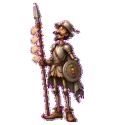
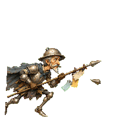
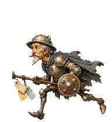
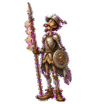
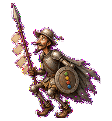
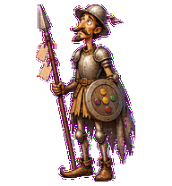
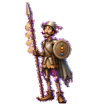
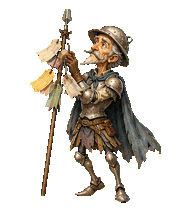
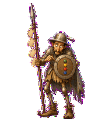

# Queue Quixote

A hopeful backlog knight who tilts at stale queues and product windmills. The
lance carries blank queue tickets, while the buckler uses colored tokens to show
what the work needs next.



## Animation Catalog

| Idle | Running Right | Running Left |
| --- | --- | --- |
|  |  |  |

| Waving | Jumping | Failed |
| --- | --- | --- |
|  |  |  |

| Waiting | Running | Review |
| --- | --- | --- |
|  |  |  |

The full Codex install asset is [`spritesheet.webp`](spritesheet.webp). GIF
previews are rendered from the committed spritesheet for GitHub review.

## Install

```bash
mkdir -p ~/.codex/pets
cp -R pets/queue-quixote ~/.codex/pets/
```

Then refresh custom pets in Codex and select `Queue Quixote`.

## Motion Notes

- `idle`: stands tall with the lance upright and queue tickets barely stirring.
- `running-right` / `running-left`: tilts lance-first toward imagined backlog
  giants.
- `waving`: gives a courtly buckler salute.
- `jumping`: makes a tiny heroic hop, with the lance and tickets lagging behind.
- `failed`: slumps after charging the wrong thing; the lance bends and the
  helmet slips.
- `waiting`: offers the buckler forward, asking for a reality check.
- `running`: sorts blank queue tickets into something almost actionable.
- `review`: leans close and nudges one buckler token into place.

## Source

- Origin: original product-folklore pet generated for Familiars.
- Author: Jorge Alcantara / Zentrik.
- License: MIT for this pet bundle in this repository.

The character is an original transformation of the public-domain Don Quixote
literary archetype. It is not based on any modern adaptation, logo, mascot, or
protected depiction.

## Preview

Full contact sheet: [preview/contact-sheet.png](preview/contact-sheet.png)
