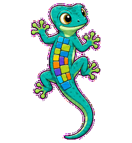
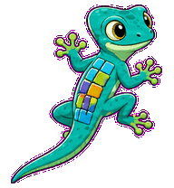
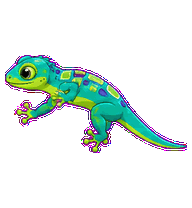
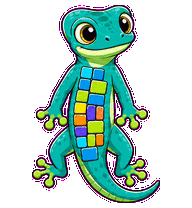
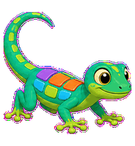
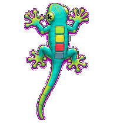
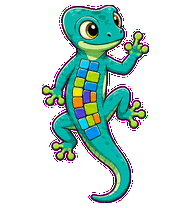
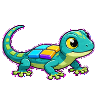
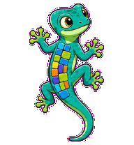

# React Gecko

A frontend state gecko whose sticky toes and color patches make component state transitions visible.



## Animation Catalog

| Idle | Running Right | Running Left |
| --- | --- | --- |
|  |  |  |

| Waving | Jumping | Failed |
| --- | --- | --- |
|  |  |  |

| Waiting | Running | Review |
| --- | --- | --- |
|  |  |  |

The full Codex install asset is [`spritesheet.webp`](spritesheet.webp). GIF previews are rendered from the committed spritesheet for GitHub review.

## Install

```bash
mkdir -p ~/.codex/pets
cp -R pets/react-gecko ~/.codex/pets/
```

Then refresh custom pets in Codex and select `React Gecko`.

## Motion Notes

- `idle`: holds a quiet wall-crawl pose with tiny toe, tail, and patch micro-motion.
- `running-right` / `running-left`: wall-crawls through sticky-toe placements.
- `waving`: greets by lifting a sticky toe or forelimb.
- `jumping`: toe-pops upward while the tail counterbalances.
- `failed`: flattens as state escapes, with dropped tail and splayed toes.
- `waiting`: freezes with one sticky toe lifted, waiting for state input.
- `running`: reorders body patches like component state transitions while braced in place.
- `review`: tilts its head at a component boundary while the toes brace.

## Source

- Origin: original pet generated for Familiars.
- Author: Jorge Alcantara / Zentrik.
- License: MIT for this pet bundle in this repository.

## Preview

Full contact sheet: [preview/contact-sheet.png](preview/contact-sheet.png)
