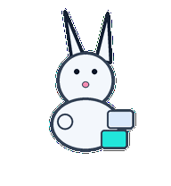
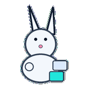
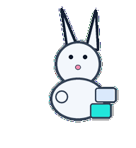
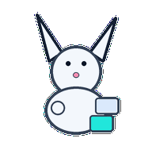
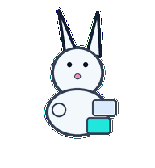

# Refactor Rabbit

A tidy refactor rabbit that rearranges attached code blocks into simpler shapes.



## Animation Catalog

| Idle | Running Right | Running Left |

| --- | --- | --- |

|  |  |  |


| Waving | Jumping | Failed |

| --- | --- | --- |

|  |  |  |


| Waiting | Running | Review |

| --- | --- | --- |

|  |  |  |


The full Codex install asset is [`spritesheet.webp`](spritesheet.webp). GIF previews are rendered from the committed spritesheet for GitHub review.

## Install

```bash
mkdir -p ~/.codex/pets
cp -R pets/refactor-rabbit ~/.codex/pets/
```

Then refresh custom pets in Codex and select `Refactor Rabbit`.

## Motion Notes

- `idle`: sits alert with one cleaned block tucked close.

- `running-right`: hops right in tidy increments, landing cleaner each time.

- `running-left`: hops left in tidy increments, landing cleaner each time.

- `waving`: raises one paw while keeping the block stack balanced.

- `jumping`: folds ears back through a high hop, then snaps upright.

- `failed`: crouches with flopped ears and a skewed attached block.

- `waiting`: sits upright with ears split between two possible refactor paths.

- `running`: rearranges attached blocks from messy stack to clean stack.

- `review`: leans in and nose-checks the cleaned block.

## Source

- Origin: original pet generated for Familiars.

- Author: Jorge Alcantara / Zentrik.

- License: MIT for this pet bundle in this repository.

## Preview

Full contact sheet: [preview/contact-sheet.png](preview/contact-sheet.png)
