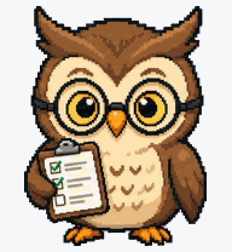
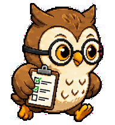
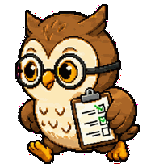
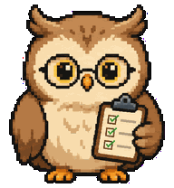
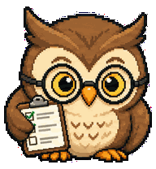
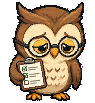
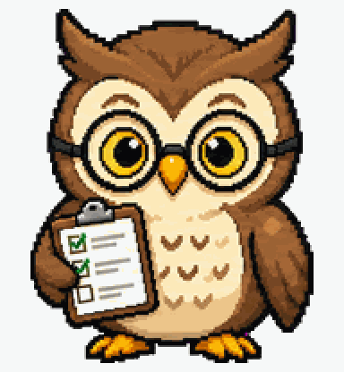
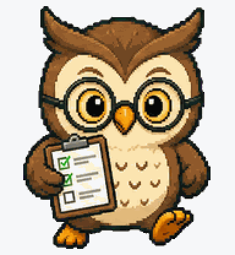
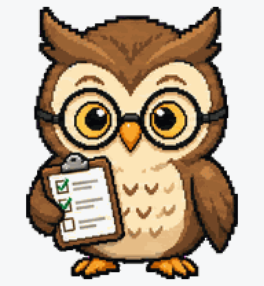

# Review Owl

Calm code-review owl with tiny glasses and a miniature PR checklist.



## Animation Catalog

| Idle | Running Right | Running Left |
| --- | --- | --- |
|  |  |  |

| Waving | Jumping | Failed |
| --- | --- | --- |
|  |  |  |

| Waiting | Running | Review |
| --- | --- | --- |
|  |  |  |

The full Codex install asset is [`spritesheet.webp`](spritesheet.webp). GIF previews are rendered from the committed spritesheet for GitHub review.

## Install

Copy this folder to:

```text
~/.codex/pets/review-owl/
```

Then open Codex App, go to `Settings > Personalization > Pets`, refresh custom pets, select `Review Owl`, and type `/pet`.

## Brief

Review Owl is a thoughtful developer pet for review states, pull requests, and quiet competence.

## States

- Idle: blinks and tilts its head.
- Working: reviews a checklist or diff.
- Waiting: raises a wing with a question mark.
- Done/review: marks a PR checklist with a green check.

## Prompt

```text
Create an original small animated Codex pet named Review Owl. It is a calm developer code-review owl with tiny glasses and a miniature pull-request checklist. Style: clean 2D pixel-art sprite, readable at small size, transparent background, original character, no copyrighted references. Mood: thoughtful, friendly, quietly competent. Design animation-ready poses for idle blinking, reviewing a diff, waiting for user input, and ready-for-review with a green checkmark.
```

## Attribution

- Source: https://github.com/gennadi-kuzmin/awesome-codex-pets
- Creator: Gennadii Kuzmin
- License: MIT
- License copy: [gennadi-kuzmin-awesome-codex-pets-MIT.txt](../../licenses/gennadi-kuzmin-awesome-codex-pets-MIT.txt)
