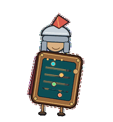
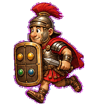
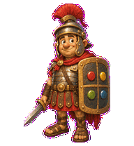
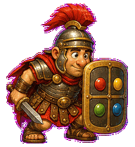
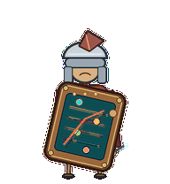
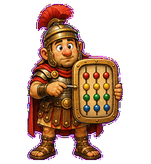
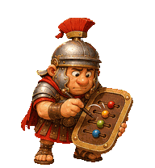
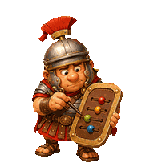

# RICE Centurion

A clumsy prioritization legionary that scores product work on a wax-tablet
shield. The four beads stand in for reach, impact, confidence, and effort
without making the sprite depend on tiny text.


## Animation Catalog

| Idle | Running Right | Running Left |
| --- | --- | --- |
|  |  |  |

| Waving | Jumping | Failed |
| --- | --- | --- |
|  |  |  |

| Waiting | Running | Review |
| --- | --- | --- |
|  |  |  |

The full Codex install asset is [`spritesheet.webp`](spritesheet.webp). GIF
previews are rendered from the committed spritesheet for GitHub review.

## Install

```bash
mkdir -p ~/.codex/pets
cp -R pets/rice-centurion ~/.codex/pets/
```

Then refresh custom pets in Codex and select `RICE Centurion`.

## Motion Notes

- `idle`: stands at attention while the plume and scoring beads barely move.
- `running-right` / `running-left`: marches tablet-first, with sandals catching
  up to the decision surface.
- `waving`: performs an over-formal stylus salute.
- `jumping`: does a disciplined hop where the heavy tablet lags behind the body.
- `failed`: jams the score diagonally and droops, but stays at post.
- `waiting`: holds the tablet outward, stylus raised, waiting for an estimate.
- `running`: slides the four beads through an active scoring loop.
- `review`: leans in and nudges one bead into final position.

## Source

- Origin: original product-folklore pet generated for Familiars.
- Author: Jorge Alcantara / Zentrik.
- License: MIT for this pet bundle in this repository.

The character uses an original antique-comic legionary archetype. It is not
based on any modern franchise character, mascot, logo, or protected adaptation.

## Preview

Full contact sheet: [preview/contact-sheet.png](preview/contact-sheet.png)
