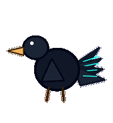
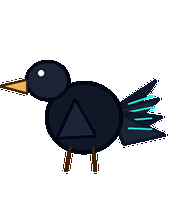
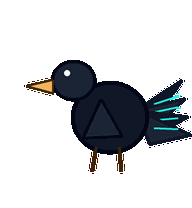
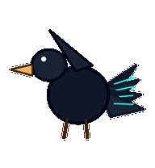
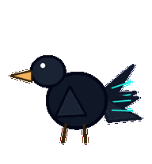
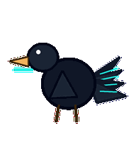
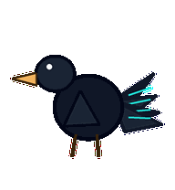
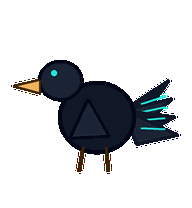

# Roadmap Raven

A planning raven whose tail feathers behave like timeline lanes and reorder by priority.



## Animation Catalog

| Idle | Running Right | Running Left |

| --- | --- | --- |

|  |  |  |


| Waving | Jumping | Failed |

| --- | --- | --- |

|  |  |  |


| Waiting | Running | Review |

| --- | --- | --- |

|  |  |  |


The full Codex install asset is [`spritesheet.webp`](spritesheet.webp). GIF previews are rendered from the committed spritesheet for GitHub review.

## Install

```bash
mkdir -p ~/.codex/pets
cp -R pets/roadmap-raven ~/.codex/pets/
```

Then refresh custom pets in Codex and select `Roadmap Raven`.

## Motion Notes

- `idle`: perches with tail feathers held as quiet timeline lanes.

- `running-right`: measured-hops right, tail lanes lagging behind like future quarters.

- `running-left`: measured-hops left with the same planning restraint.

- `waving`: lifts one dark wing as a bracket around the next decision.

- `jumping`: makes a low raven hop with wings held like planning brackets.

- `failed`: ruffles tail lanes out of sequence and loses its confident planning angle.

- `waiting`: holds its beak still over the next milestone, waiting for priority truth.

- `running`: reorders tail feathers from near-term to later-later-later.

- `review`: tracks the timeline left to right with one bright, skeptical eye.

## Source

- Origin: original pet generated for Familiars.

- Author: Jorge Alcantara / Zentrik.

- License: MIT for this pet bundle in this repository.

## Preview

Full contact sheet: [preview/contact-sheet.png](preview/contact-sheet.png)
