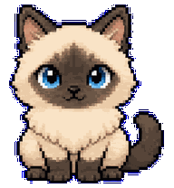
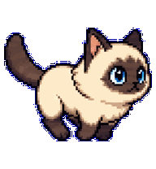
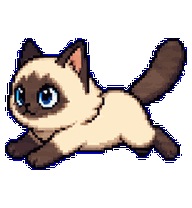
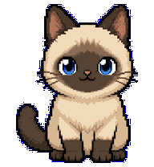
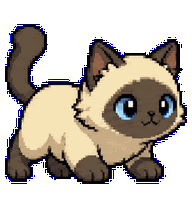
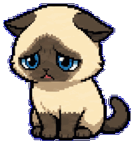
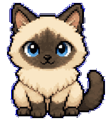
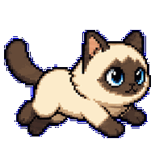
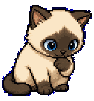

# Rozi

A British Shorthair x Ragdoll mix cat Codex pet.



## Animation Catalog

| Idle | Running Right | Running Left |
| --- | --- | --- |
|  |  |  |

| Waving | Jumping | Failed |
| --- | --- | --- |
|  |  |  |

| Waiting | Running | Review |
| --- | --- | --- |
|  |  |  |

The full Codex install asset is [`spritesheet.webp`](spritesheet.webp). GIF previews are rendered from the committed spritesheet for GitHub review.

## Install

```bash
mkdir -p ~/.codex/pets
cp -R pets/rozi ~/.codex/pets/
```

Then refresh custom pets in Codex and select `Rozi`.

## Attribution

- Source: https://github.com/mertcreates/codex-paws
- Creator: mertcreates
- License: CC BY 4.0

## Preview

Full contact sheet: [preview/contact-sheet.png](preview/contact-sheet.png)
