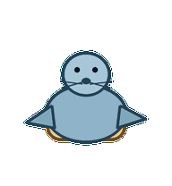
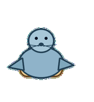
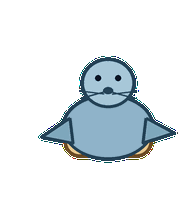
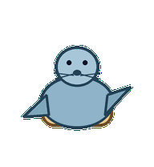
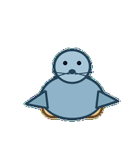
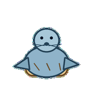

# Sandbox Seal

A compact sandbox seal that pats safe experiment boundaries into place before anything escapes.



## Animation Catalog

| Idle | Running Right | Running Left |

| --- | --- | --- |

|  |  |  |


| Waving | Jumping | Failed |

| --- | --- | --- |

|  |  |  |


| Waiting | Running | Review |

| --- | --- | --- |

|  |  |  |


The full Codex install asset is [`spritesheet.webp`](spritesheet.webp). GIF previews are rendered from the committed spritesheet for GitHub review.

## Install

```bash
mkdir -p ~/.codex/pets
cp -R pets/sandbox-seal ~/.codex/pets/
```

Then refresh custom pets in Codex and select `Sandbox Seal`.

## Motion Notes

- `idle`: balances low with flippers tucked around a safe test boundary.

- `running-right`: belly-scoots right with flippers steering the boundary.

- `running-left`: belly-scoots left with flippers steering the boundary.

- `waving`: raises one flipper while keeping the sandbox edge held.

- `jumping`: does a compact flipper bounce without leaving the boundary behind.

- `failed`: flops sideways as the boundary dents but stays attached.

- `waiting`: balances upright, flippers tucked, asking whether to proceed.

- `running`: pats the attached sandbox boundary into a cleaner shape.

- `review`: checks the sandbox edge with its nose while flippers hold position.

## Source

- Origin: original pet generated for Familiars.

- Author: Jorge Alcantara / Zentrik.

- License: MIT for this pet bundle in this repository.

## Preview

Full contact sheet: [preview/contact-sheet.png](preview/contact-sheet.png)
