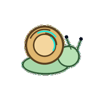
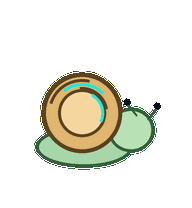
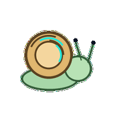
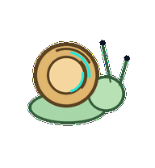

# Schema Snail

A careful schema snail whose shell bands align one notch at a time before anything migrates.


## Animation Catalog

| Idle | Running Right | Running Left |

| --- | --- | --- |

|  |  |  |


| Waving | Jumping | Failed |

| --- | --- | --- |

|  |  |  |


| Waiting | Running | Review |

| --- | --- | --- |

|  |  |  |


The full Codex install asset is [`spritesheet.webp`](spritesheet.webp). GIF previews are rendered from the committed spritesheet for GitHub review.

## Install

```bash
mkdir -p ~/.codex/pets
cp -R pets/schema-snail ~/.codex/pets/
```

Then refresh custom pets in Codex and select `Schema Snail`.

## Motion Notes

- `idle`: glides slowly while version-like shell bands rotate almost imperceptibly.

- `running-right`: glides right with the shell bands staying readable.

- `running-left`: glides left with the same deliberate schema cadence.

- `waving`: extends one eyestalk in a cautious acknowledgement.

- `jumping`: does not truly jump; the shell lifts as the body stretches forward.

- `failed`: retracts eyestalks and lets the shell tilt out of alignment.

- `waiting`: extends both eyestalks toward the user for migration approval.

- `running`: aligns shell bands notch by notch until the stripe stack is clean.

- `review`: uses one long eyestalk to inspect the shell-band alignment.

## Source

- Origin: original pet generated for Familiars.

- Author: Jorge Alcantara / Zentrik.

- License: MIT for this pet bundle in this repository.

## Preview

Full contact sheet: [preview/contact-sheet.png](preview/contact-sheet.png)
