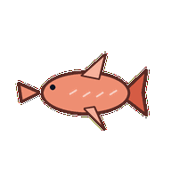
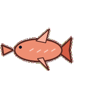
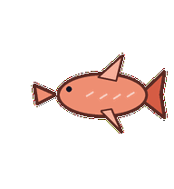
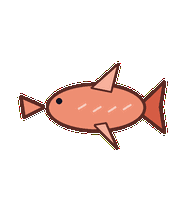
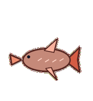
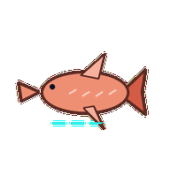
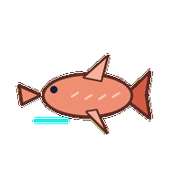

# Search Salmon

A code-search salmon that swims upstream through results, tail beats acting like query refinements.



## Animation Catalog

| Idle | Running Right | Running Left |

| --- | --- | --- |

|  |  |  |


| Waving | Jumping | Failed |

| --- | --- | --- |

|  |  |  |


| Waiting | Running | Review |

| --- | --- | --- |

|  |  |  |


The full Codex install asset is [`spritesheet.webp`](spritesheet.webp). GIF previews are rendered from the committed spritesheet for GitHub review.

## Install

```bash
mkdir -p ~/.codex/pets
cp -R pets/search-salmon ~/.codex/pets/
```

Then refresh custom pets in Codex and select `Search Salmon`.

## Motion Notes

- `idle`: hovers in a quiet upstream posture with a slow tail beat.

- `running-right`: swims right through the air with the tail marking search steps.

- `running-left`: swims left through the air with the same upstream cadence.

- `waving`: flicks a fin once, like marking a promising result.

- `jumping`: leaps in a clean arc and tucks the tail at the peak.

- `failed`: dips downstream as the tail beat slows.

- `waiting`: suspends mid-swim and looks toward the user for query refinement.

- `running`: darts its nose between attached result-ridge marks while the tail keeps cadence.

- `review`: turns slightly side-on to inspect one result with a narrowed eye.

## Source

- Origin: original pet generated for Familiars.

- Author: Jorge Alcantara / Zentrik.

- License: MIT for this pet bundle in this repository.

## Preview

Full contact sheet: [preview/contact-sheet.png](preview/contact-sheet.png)
