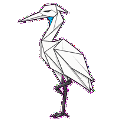
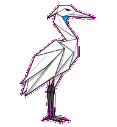
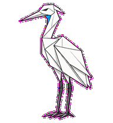
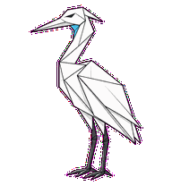
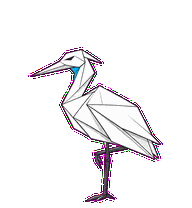
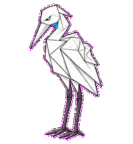
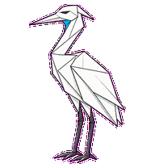
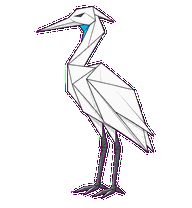

# Signal Heron

A zen folded heron that hears customer signal by becoming still.



## Animation Catalog

| Idle | Running Right | Running Left |
| --- | --- | --- |
|  |  |  |

| Waving | Jumping | Failed |
| --- | --- | --- |
|  |  |  |

| Waiting | Running | Review |
| --- | --- | --- |
|  |  |  |

The full Codex install asset is [`spritesheet.webp`](spritesheet.webp). GIF previews are rendered from the committed spritesheet for GitHub review.

## Install

```bash
mkdir -p ~/.codex/pets
cp -R pets/signal-heron ~/.codex/pets/
```

Then refresh custom pets in Codex and select `Signal Heron`.

## Motion Notes

- `waiting`: folds into a meditative tuck and opens one eye toward the signal accent.
- `running`: aligns a body-attached cyan signal thread through the throat and wing folds.
- `review`: opens folded wings just enough to reveal one clean cyan line.
- `failed`: ruffles body facets while preserving a dim cyan throat accent.

## Source

- Origin: original pet generated for Familiars.
- Author: Jorge Alcantara / Zentrik.
- License: MIT for this pet bundle in this repository.

## Preview

Full contact sheet: [preview/contact-sheet.png](preview/contact-sheet.png)
