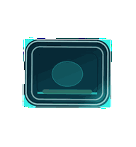
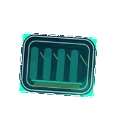
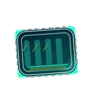
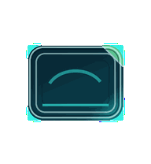
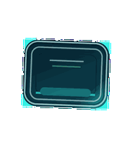
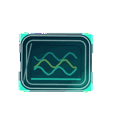
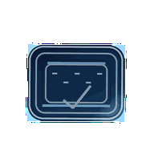

# Signal Surface

A quiet, non-creature familiar for people who want a useful companion more than
a mascot. Signal Surface behaves like a small glass instrument: color, tempo,
and scan direction carry the state so the meaning stays readable in the corner
of the screen.



## Animation Catalog

| Idle | Running Right | Running Left |
| --- | --- | --- |
|  |  |  |

| Waving | Jumping | Failed |
| --- | --- | --- |
|  |  |  |

| Waiting | Running | Review |
| --- | --- | --- |
|  |  |  |

The full Codex install asset is [`spritesheet.webp`](spritesheet.webp). GIF previews are rendered from the committed spritesheet for GitHub review.

## Install

```bash
mkdir -p ~/.codex/pets
cp -R pets/signal-surface ~/.codex/pets/
```

Then refresh custom pets in Codex and select `Signal Surface`.

## Motion Notes

- `idle`: breathes in cyan with a calm low signal bar.
- `running-right` / `running-left`: sends vertical color sweeps in the travel direction.
- `waving`: folds one corner up like a tiny polite page tab.
- `jumping`: lifts as a liquid status fill rises inside the glass.
- `failed`: blooms red-orange, fractures internally, then steadies without scattering debris.
- `waiting`: warms into amber with a slow centered pulse.
- `running`: streams layered cyan and green waves through the surface.
- `review`: becomes crisp blue-white with a horizontal scan and small inspection ticks.

## Source

- Origin: original pet generated for Familiars.
- Author: Jorge Alcantara / Zentrik.
- License: MIT for this pet bundle in this repository.
- Generator: [`scripts/generate_signal_surface.py`](../../scripts/generate_signal_surface.py).

## Preview

Full contact sheet: [preview/contact-sheet.png](preview/contact-sheet.png)
