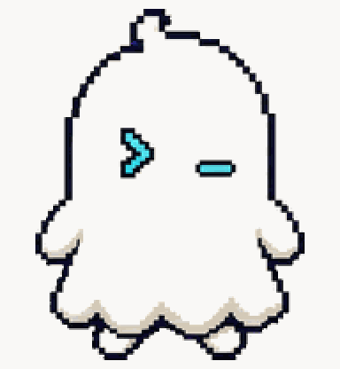
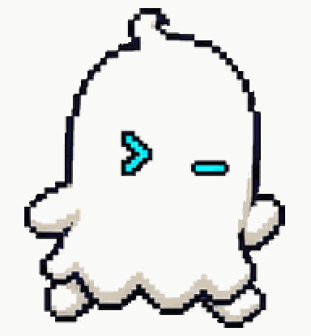
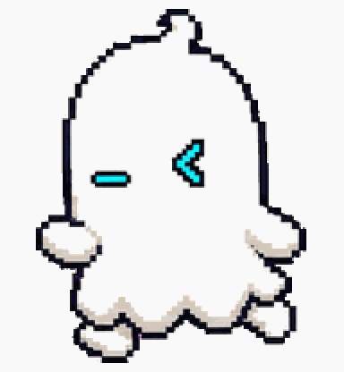
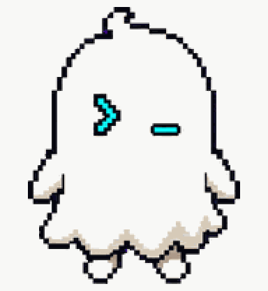
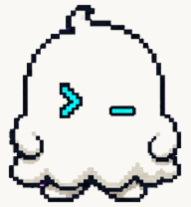
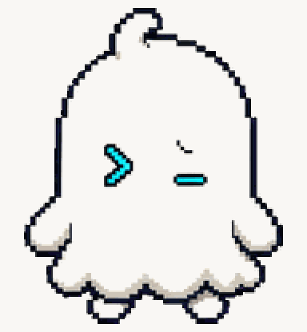
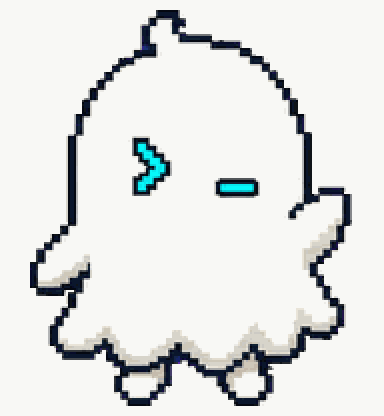
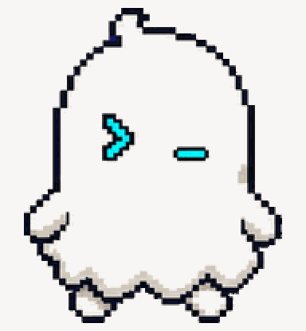
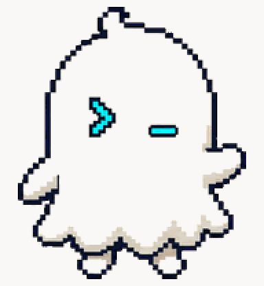

# Terminal Ghost

Friendly tiny CLI ghost for developers.



## Animation Catalog

| Idle | Running Right | Running Left |
| --- | --- | --- |
|  |  |  |

| Waving | Jumping | Failed |
| --- | --- | --- |
|  |  |  |

| Waiting | Running | Review |
| --- | --- | --- |
|  |  |  |

The full Codex install asset is [`spritesheet.webp`](spritesheet.webp). GIF previews are rendered from the committed spritesheet for GitHub review.

## Install

Copy this folder to:

```text
~/.codex/pets/terminal-ghost/
```

Then open Codex App, go to `Settings > Personalization > Pets`, refresh custom pets, select `Terminal Ghost`, and type `/pet`.

## Brief

Terminal Ghost is a small original Codex pet with prompt-shaped eyes like `>` and `_`, a subtle cyan terminal glow, and a curious helper mood.

## States

- Idle: gently floats and blinks.
- Working: emits terminal sparks or typing dots.
- Waiting: holds a blinking cursor.
- Done/review: shows a green check or prompt line.

## Prompt

```text
Create an original small animated Codex pet character named Terminal Ghost. It is a friendly tiny CLI ghost for developers, with prompt-shaped eyes like ">" and "_" and a subtle cyan terminal glow. Style: clean pixel-art inspired 2D sprite, readable at small size, transparent background, no copyrighted characters, no scary horror mood. The pet should feel curious, helpful, and slightly playful. Design animation-ready poses for idle, working, waiting for input, and ready for review.
```

## Attribution

- Source: https://github.com/gennadi-kuzmin/awesome-codex-pets
- Creator: Gennadii Kuzmin
- License: MIT
- License copy: [gennadi-kuzmin-awesome-codex-pets-MIT.txt](../../licenses/gennadi-kuzmin-awesome-codex-pets-MIT.txt)
