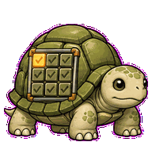
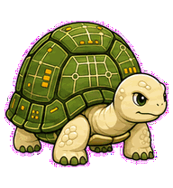
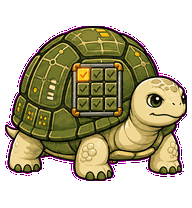
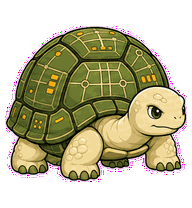
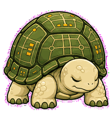
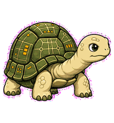
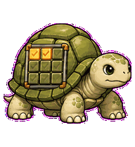
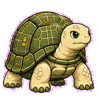

# Test Tortoise

A slow reliable test-runner tortoise whose shell panels move through a tidy
test matrix.



## Animation Catalog

| Idle | Running Right | Running Left |
| --- | --- | --- |
|  |  |  |

| Waving | Jumping | Failed |
| --- | --- | --- |
|  |  |  |

| Waiting | Running | Review |
| --- | --- | --- |
|  |  |  |

The full Codex install asset is [`spritesheet.webp`](spritesheet.webp). GIF previews are rendered from the committed spritesheet for GitHub review.

## Install

```bash
mkdir -p ~/.codex/pets
cp -R pets/test-tortoise ~/.codex/pets/
```

Then refresh custom pets in Codex and select `Test Tortoise`.

## Motion Notes

- `waiting`: extends its head and holds, asking for the next test target.
- `running`: ticks attached shell panels through a test-matrix loop.
- `review`: peers over the shell rim at final results.
- `failed`: retracts halfway while the shell dips.

## Source

- Origin: original pet generated for Familiars.
- Author: Jorge Alcantara / Zentrik.
- License: MIT for this pet bundle in this repository.

## Preview

Full contact sheet: [preview/contact-sheet.png](preview/contact-sheet.png)
