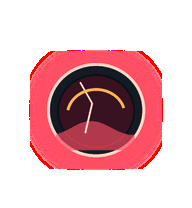

# Tide Stone

A polished companion object with liquid light inside. It is deliberately calm:
the tide rolls for idle, pools amber when waiting, surges for work, clears for
review, and flashes coral-red when something fails.


## Animation Catalog

| Idle | Running Right | Running Left |
| --- | --- | --- |
|  |  |  |

| Waving | Jumping | Failed |
| --- | --- | --- |
|  |  |  |

| Waiting | Running | Review |
| --- | --- | --- |
|  |  |  |

The full Codex install asset is [`spritesheet.webp`](spritesheet.webp). GIF previews are rendered from the committed spritesheet for GitHub review.

## Install

```bash
mkdir -p ~/.codex/pets
cp -R pets/tide-stone ~/.codex/pets/
```

Then refresh custom pets in Codex and select `Tide Stone`.

## Motion Notes

- `idle`: internal tide rolls slowly under a polished shell.
- `running-right` / `running-left`: liquid leans in the movement direction.
- `waving`: the tide rises into a small curling wave.
- `jumping`: a bright bubble lifts inside the stone.
- `failed`: coral-red tide recedes under a visible crack.
- `waiting`: amber liquid pools and pulses at the center.
- `running`: cyan waves accelerate through the stone.
- `review`: the liquid clears into a scanning lens.

## Source

- Origin: original state-instrument pet generated for Familiars.
- Author: Jorge Alcantara / Zentrik.
- License: MIT for this pet bundle in this repository.
- Generator: [`scripts/generate_state_instruments.py`](../../scripts/generate_state_instruments.py).

## Preview

Full contact sheet: [preview/contact-sheet.png](preview/contact-sheet.png)
