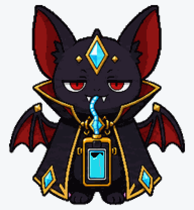
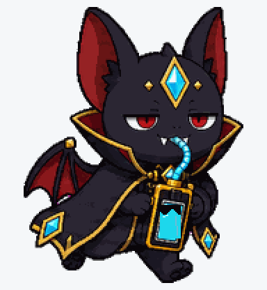
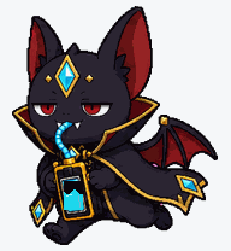
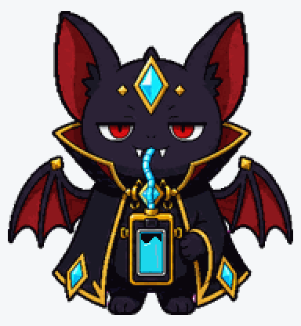
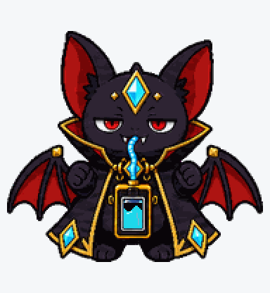
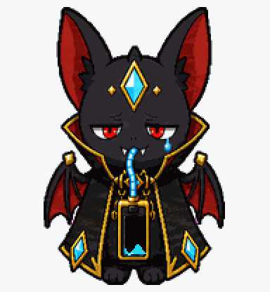
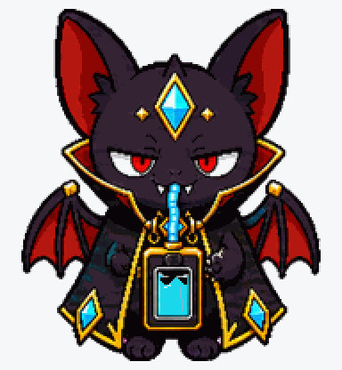
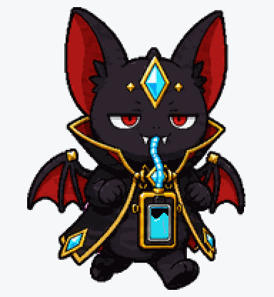
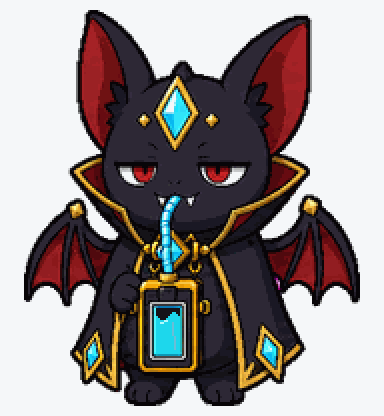

# Token Vampire

A smug little vampire bat who drinks coding limits like cyan token juice.



## Animation Catalog

| Idle | Running Right | Running Left |
| --- | --- | --- |
|  |  |  |

| Waving | Jumping | Failed |
| --- | --- | --- |
|  |  |  |

| Waiting | Running | Review |
| --- | --- | --- |
|  |  |  |

The full Codex install asset is [`spritesheet.webp`](spritesheet.webp). GIF previews are rendered from the committed spritesheet for GitHub review.

## Install

Copy this folder to:

```text
~/.codex/pets/token-vampire/
```

Then open Codex App, go to `Settings > Personalization > Pets`, refresh custom pets, select `Token Vampire`, and type `/pet`.

## Brief

Token Vampire is a charming little vampire-bat companion with smug eyes, tiny fangs, a token meter collar, and cyan token juice.

## States

- Idle: looks charmingly expensive.
- Running: dashes after the next token.
- Waiting: waits with dramatic patience.
- Review: judges your token budget with smug confidence.

## Attribution

- Source: https://github.com/gennadi-kuzmin/awesome-codex-pets
- Creator: Gennadii Kuzmin
- License: MIT
- License copy: [gennadi-kuzmin-awesome-codex-pets-MIT.txt](../../licenses/gennadi-kuzmin-awesome-codex-pets-MIT.txt)
