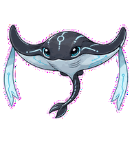
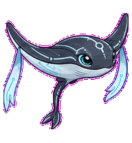
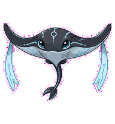
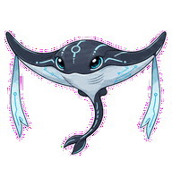
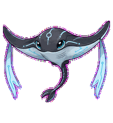

# Trace Manta

An observability manta whose fins ripple like trace spans flowing downstream.



## Animation Catalog

| Idle | Running Right | Running Left |
| --- | --- | --- |
|  |  |  |

| Waving | Jumping | Failed |
| --- | --- | --- |
|  |  |  |

| Waiting | Running | Review |
| --- | --- | --- |
|  |  |  |

The full Codex install asset is [`spritesheet.webp`](spritesheet.webp). GIF previews are rendered from the committed spritesheet for GitHub review.

## Install

```bash
mkdir -p ~/.codex/pets
cp -R pets/trace-manta ~/.codex/pets/
```

Then refresh custom pets in Codex and select `Trace Manta`.

## Motion Notes

- `idle`: hovers in a calm systems-thinking float with small fin breathing.
- `running-right` / `running-left`: glides directionally with fin ripples instead of legs.
- `waving`: greets through a restrained fin lift, with no loose wave marks.
- `jumping`: rises in a soft banking glide rather than a ground-bound jump.
- `failed`: dips with one uneven folded fin, like a trace with a broken span.
- `waiting`: pauses halfway through a ripple while waiting for input.
- `running`: pushes ordered attached fin ripples downstream like trace flow.
- `review`: banks to expose a fin edge as if highlighting one span.

## Source

- Origin: original pet generated for Familiars.
- Author: Jorge Alcantara / Zentrik.
- License: MIT for this pet bundle in this repository.

## Preview

Full contact sheet: [preview/contact-sheet.png](preview/contact-sheet.png)
